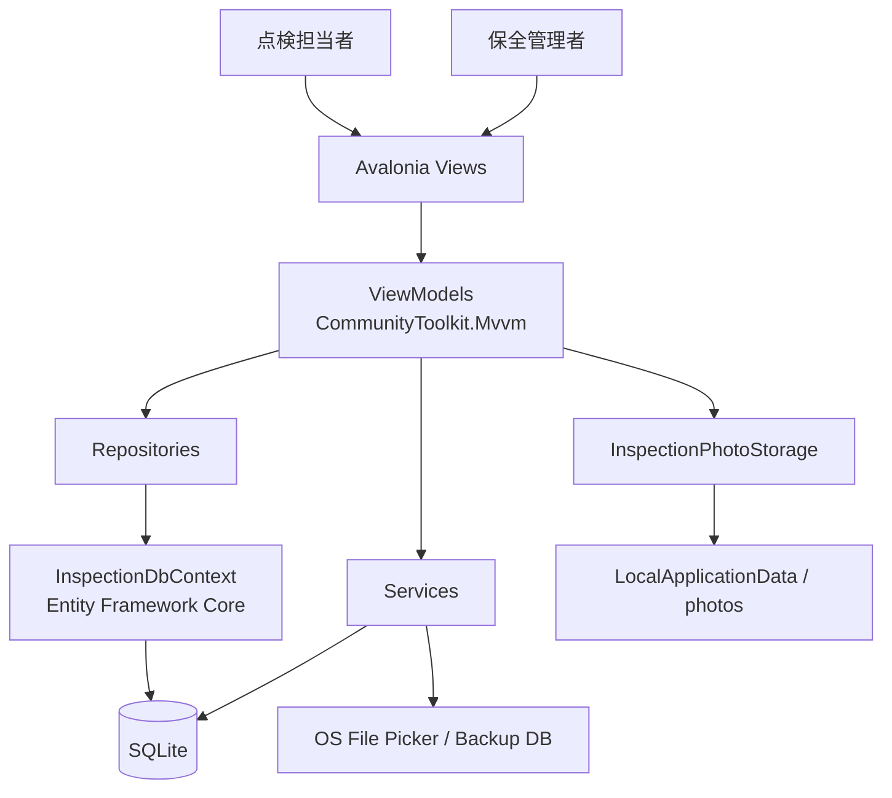
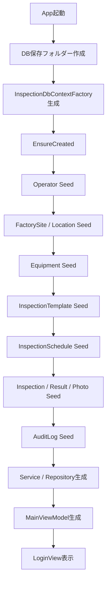
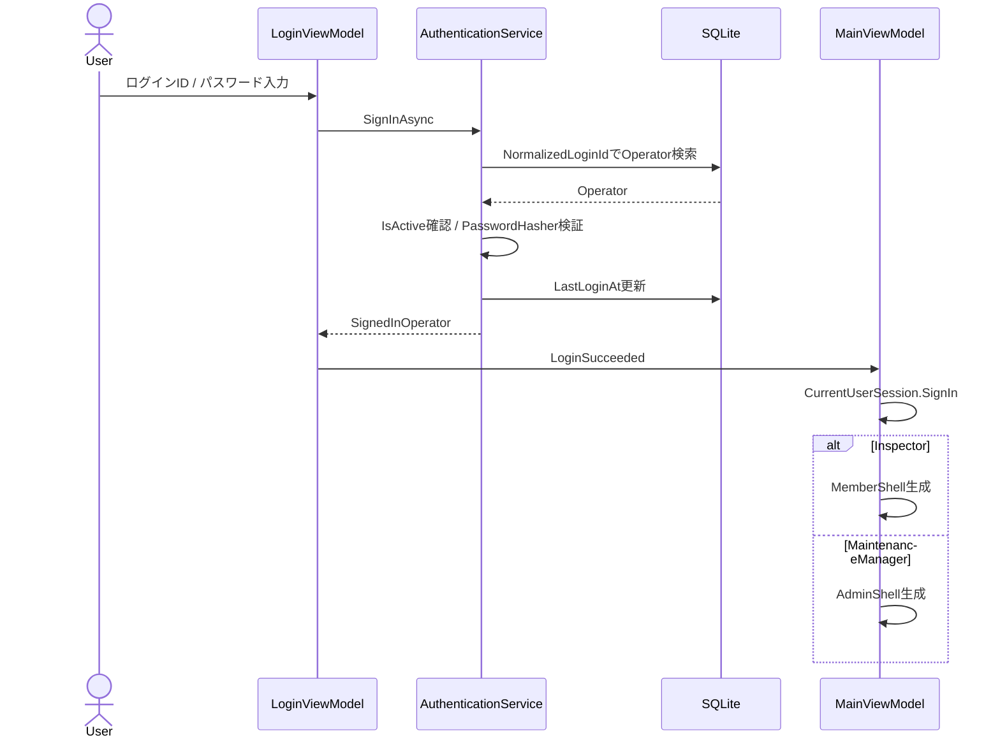
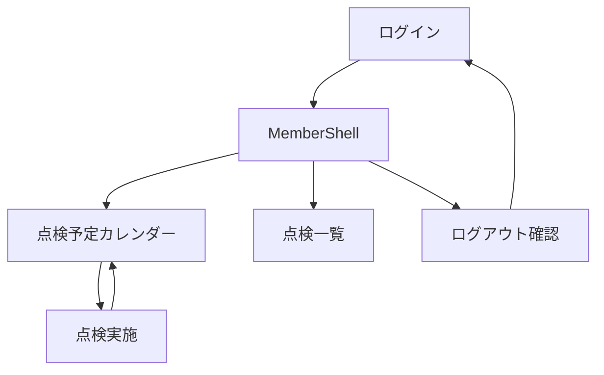
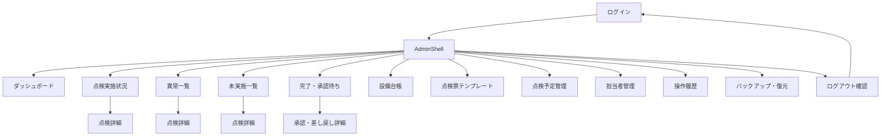
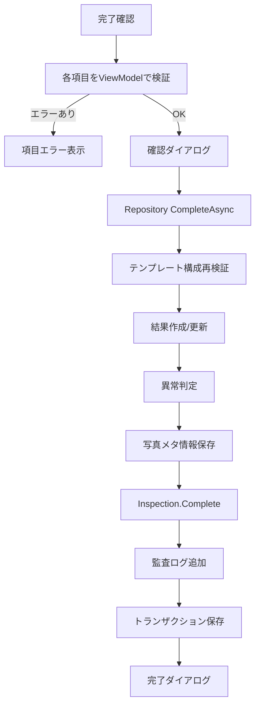
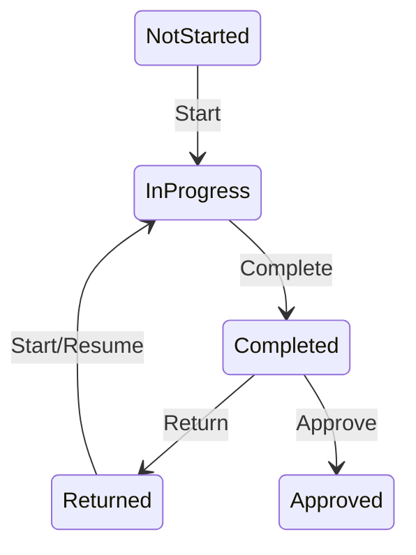
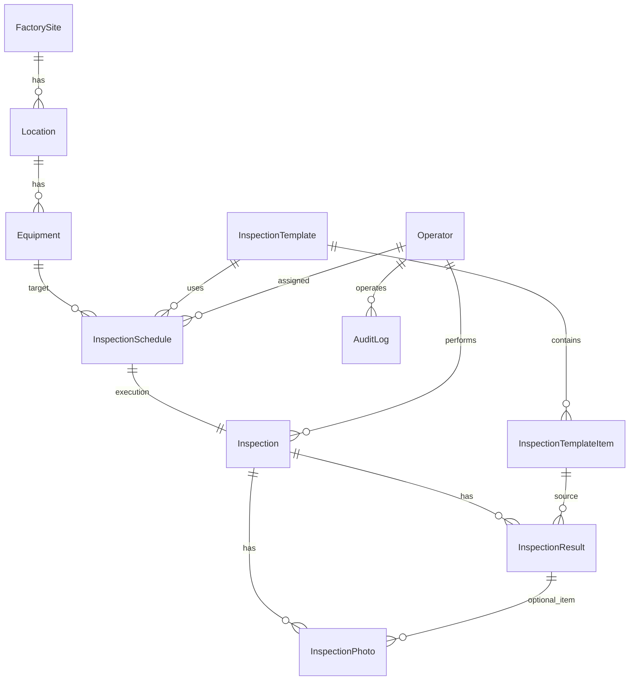
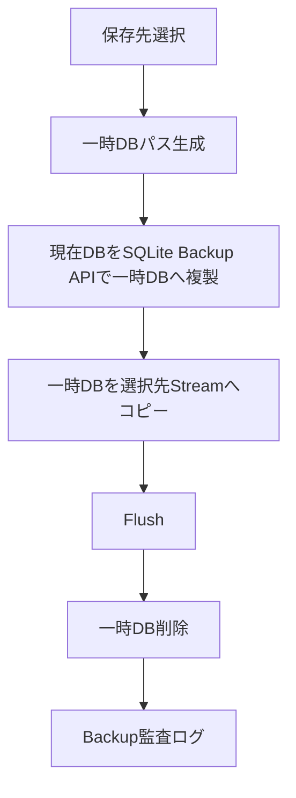
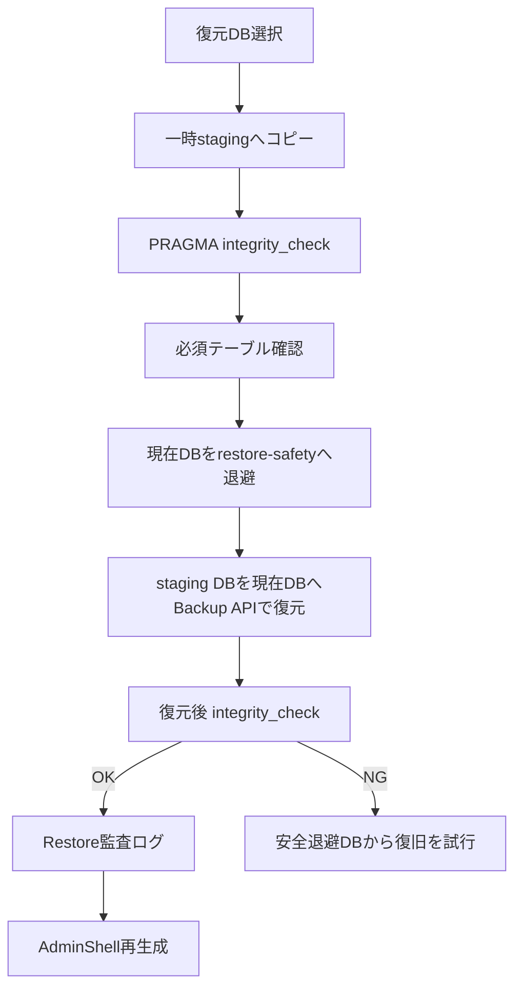

# FacilityInspection 基本設計書

| 項目 | 内容 |
|---|---|
| 文書名 | FacilityInspection 基本設計書 |
| 対象システム | 設備点検・保守記録アプリ FacilityInspection |
| 基準文書 | `FacilityInspection_要件定義書.md` |
| 対象版 | Desktop版（現行実装基準） |
| 文書版 | 1.0 |
| 作成日 | 2026-08-21 |

---

## 1. 目的

本書は、FacilityInspection要件定義書で定義した要件を実現するための、システム構成、画面構成、画面遷移、権限制御、論理データ設計、状態遷移、主要処理方式、バックアップ方式および共通設計方針を定義する。

詳細なクラス、メソッド、物理テーブル項目、ViewModelプロパティ・Command、バリデーション処理は詳細設計書で定義する。

---

## 2. システム構成

### 2.1 全体構成



### 2.2 アーキテクチャ方針

| レイヤー／要素 | 主な責務 |
|---|---|
| Views | Avalonia XAMLによる画面表示、Binding、Command呼出し |
| ViewModels | 表示状態、入力状態、画面遷移要求、Command、画面用バリデーション |
| Domain | エンティティ状態、状態遷移、値の正規化、ドメインルール |
| Repositories | EF Coreを用いた検索、登録、更新、業務トランザクション |
| Services | 認証、ログインセッション、DBバックアップ／復元、ファイル選択 |
| InspectionDbContext | SQLite接続、DbSet、Entity Configuration適用 |
| Local File Storage | SQLite DB、写真ファイル、安全退避DB |

現行プロジェクトは物理的な複数プロジェクト分割ではなく、主アプリプロジェクト内で`Domain`、`Data`、`Services`、`ViewModels`、`Views`に責務を分離する。

### 2.3 技術スタック

| 分類 | 採用技術 |
|---|---|
| Language | C# |
| Runtime | .NET 10 |
| UI | Avalonia UI 12.1.0 |
| MVVM Support | CommunityToolkit.Mvvm 8.4.2 |
| ORM | Entity Framework Core 10.0.10 |
| Database | SQLite |
| Authentication | Microsoft.Extensions.Identity.Core / PasswordHasher |
| Testing | xUnit 2.9.3 |
| Test SDK | Microsoft.NET.Test.Sdk 17.14.1 |
| Coverage | coverlet.collector 6.0.4 |
| CI | GitHub Actions |

---

## 3. 実行・データ配置設計

### 3.1 Desktop起動

Desktopエントリポイントは`FacilityInspection.Desktop/Program.cs`とし、`StartWithClassicDesktopLifetime`でAvalonia Desktopアプリを起動する。

### 3.2 メインウィンドウ

| 項目 | 設定 |
|---|---|
| Title | 設備点検・保守記録アプリ |
| Width | 1200 |
| Height | 800 |
| MinWidth | 1000 |
| MinHeight | 650 |
| Icon | `/Assets/facility-inspection.ico` |

### 3.3 DB保存先

起動時に`Environment.SpecialFolder.LocalApplicationData`配下へアプリ専用ディレクトリを作成する。

```text
<LocalApplicationData>/FacilityInspection/facility-inspection.db
```

Windowsでは概ね以下となる。

```text
%LOCALAPPDATA%\FacilityInspection\facility-inspection.db
```

DBは起動時に`Database.EnsureCreated()`で初期化する。

### 3.4 写真保存先

点検写真は以下の構造で保存する。

```text
<LocalApplicationData>/FacilityInspection/
└─ photos/
   └─ {scheduleId:N}/
      └─ {templateItemId:N}/
         └─ {generated-guid}{extension}
```

DBの`InspectionPhotos.RelativePath`には`photos/...`から始まる相対パスを保存する。

### 3.5 復元安全退避

```text
<LocalApplicationData>/FacilityInspection/
└─ restore-safety/
   └─ facility-inspection_before_restore_yyyyMMdd_HHmmss.db
```

---

## 4. 起動時初期化

アプリ起動時は以下の順で初期化する。



初期データは既存データを考慮し、主に不足分を追加するデモ用途のSeedとして扱う。

---

## 5. 認証・セッション設計

### 5.1 認証処理



### 5.2 セッション

`CurrentUserSession`はプロセス内メモリに現在ユーザーを保持する。

保持情報：

- Operator ID
- Login ID
- Display Name
- Role

永続ログイントークンやCookieは使用しない。

### 5.3 ロール別遷移

| Role | ログイン後画面 |
|---|---|
| Inspector | `MemberShellViewModel` |
| MaintenanceManager | `AdminShellViewModel` |

---

## 6. 画面一覧

### 6.1 共通画面

| 画面ID | 画面 | View | ViewModel | 概要 |
|---|---|---|---|---|
| SCR-001 | メイン | MainView | MainViewModel | ログインまたは各Shellを表示するルート画面 |
| SCR-002 | ログイン | LoginView | LoginViewModel | ローカル認証 |
| SCR-003 | ログアウト確認 | 各Shell内ダイアログ | MemberShellViewModel / AdminShellViewModel | ログアウト確認 |

### 6.2 点検担当者画面

| 画面ID | 画面 | View | ViewModel | 概要 |
|---|---|---|---|---|
| MEM-101 | 点検担当者Shell | MemberShellView | MemberShellViewModel | サイドメニュー、現在コンテンツ表示 |
| MEM-102 | 点検予定 | MemberDashboardView | MemberDashboardViewModel | 担当予定カレンダー、日別予定 |
| MEM-103 | 点検一覧 | MemberInspectionListView | MemberInspectionListViewModel | 担当予定を5件単位で表示 |
| MEM-104 | 点検実施 | InspectionEntryView | InspectionEntryViewModel | 点検項目入力、写真、完了 |

### 6.3 保全管理者画面

| 画面ID | 画面 | View | ViewModel | 概要 |
|---|---|---|---|---|
| ADM-201 | 管理者Shell | AdminShellView | AdminShellViewModel | 管理者サイドメニュー、現在コンテンツ表示 |
| ADM-202 | ダッシュボード | AdminDashboardView | AdminDashboardViewModel | 本日の予定・未実施・承認待ち・異常・進捗 |
| ADM-203 | 点検実施状況 | InspectionStatusView | InspectionStatusViewModel | 全点検一覧、検索・状態フィルター、5件ページング |
| ADM-204 | 点検実施詳細 | InspectionDetailView | InspectionDetailViewModel | 点検基本情報、項目結果、写真 |
| ADM-205 | 異常一覧 | AbnormalListView | AbnormalListViewModel | 異常結果を項目単位で表示、5件ページング |
| ADM-206 | 未実施一覧 | NotStartedListView | NotStartedListViewModel | 未実施予定の一覧、5件ページング |
| ADM-207 | 完了・承認待ち | ApprovalPendingListView | ApprovalPendingListViewModel | Completed点検一覧 |
| ADM-208 | 承認・差し戻し | ApprovalPendingDetailView | ApprovalPendingDetailViewModel | 結果確認、承認、差し戻し |
| ADM-209 | 設備台帳管理 | EquipmentManagementView | EquipmentManagementViewModel | 設備登録・一覧 |
| ADM-210 | 点検票テンプレート管理 | InspectionTemplateManagementView | InspectionTemplateManagementViewModel | テンプレート作成・編集・有効切替 |
| ADM-211 | 点検予定管理 | ScheduleCalendarView | ScheduleCalendarViewModel | 月カレンダー、予定作成・編集・取消 |
| ADM-212 | 担当者管理 | OperatorManagementView | OperatorManagementViewModel | 担当者作成・編集・有効切替 |
| ADM-213 | 操作履歴 | AuditLogView | AuditLogViewModel | 監査ログ検索、10件ページング |
| ADM-214 | バックアップ・復元 | BackupRestoreView | BackupRestoreViewModel | `.db`バックアップ／復元 |

---

## 7. 画面遷移設計

### 7.1 点検担当者

既存図：`docs/images/member-screen-flow.png`

設計上の遷移は以下とする。



点検予定画面から、未実施・実施中・差し戻し状態に応じて点検開始／再開を行う。

### 7.2 保全管理者

既存図：`docs/images/admin-screen-flow.png`



### 7.3 ダッシュボードショートカット

ダッシュボードから以下へ直接遷移可能とする。

- 点検実施状況
- 未実施一覧
- 完了・承認待ち
- 異常一覧

---

## 8. 画面共通設計

### 8.1 状態表現

各一覧・詳細画面では、原則として次のUI状態を持つ。

- 読込中
- 正常表示
- データなし
- エラー
- 処理中

### 8.2 メッセージ

- 業務ルール違反：具体的な理由を表示する。
- 予期しない例外：画面操作の文脈に応じた共通メッセージ＋必要に応じて例外メッセージを表示する。
- 重要操作：確認ダイアログを表示する。

### 8.3 ページング

| 画面 | ページサイズ |
|---|---:|
| 点検担当者 点検一覧 | 5 |
| 点検実施状況 | 5 |
| 未実施一覧 | 5 |
| 異常一覧 | 5 |
| 操作履歴 | 10 |

---

## 9. 点検予定画面設計

### 9.1 月カレンダー

- 前月／次月／今日への移動を提供する。
- 1日ごとに予定件数と状態サマリーを表示する。
- 日付選択時に当日の予定一覧を表示する。

### 9.2 状態表示

管理者カレンダーでは以下を識別する。

- 未実施
- 実施中
- 完了・承認待ち
- 承認済み
- 期限超過・差し戻し

### 9.3 予定編集ダイアログ

入力項目：

1. 点検予定日
2. 工場
3. 設置場所
4. 設備
5. 点検票テンプレート
6. 点検担当者
7. 備考

選択肢は依存関係に応じて段階的に再読込する。

```text
工場
 ↓
設置場所
 ↓
設備
 ↓
設備種別に対応する有効テンプレート
```

担当者は有効なInspectorのみを候補とする。

---

## 10. 点検実施画面設計

### 10.1 基本情報

表示項目：

- 予定日
- 工場・場所
- 設備コード・設備名
- 点検票名
- 点検状態

### 10.2 入力形式

| InputType | UI | 正常側 | 異常側／扱い |
|---|---|---|---|
| NormalAbnormal | RadioButton | 正常 | 異常 |
| DoneNotDone | RadioButton | 実施 | 未実施 |
| Numeric | TextBox | 基準内 | 下限未満／上限超過 |
| Text | TextBox | 自動判定なし | 自動判定なし |

### 10.3 基準値表示

数値入力ではテンプレートに設定された下限・上限と単位を表示する。

例：

```text
基準: 0.5 ～ 0.8 MPa
基準: 10 A 以上
基準: 25 A 以下
```

### 10.4 写真

各点検項目に写真を複数登録できる。画面離脱時、完了保存されていない写真は削除する設計とする。

### 10.5 完了処理



---

## 11. 点検状態設計

### 11.1 状態定義

| Status | 画面表示 | 説明 |
|---|---|---|
| NotStarted | 未実施 | 予定登録後、点検開始前 |
| InProgress | 実施中 | 点検開始後 |
| Completed | 完了・承認待ち | 点検担当者が完了 |
| Returned | 差し戻し | 管理者が修正要求 |
| Approved | 承認済み | 管理者が承認 |

### 11.2 状態遷移ルール



不正な遷移はDomainまたはRepositoryで例外とする。

---

## 12. 承認・差し戻し設計

### 12.1 承認画面表示

- 設備
- 予定日
- 状態
- 工場・場所
- 点検票
- 点検担当者
- 結果件数
- 異常件数
- 写真件数
- 点検項目別結果
- コメント
- 写真

### 12.2 承認

- 対象状態がCompletedであることを確認する。
- `Inspection.Approve(DateTime.UtcNow)`を実行する。
- `AuditActionType.Approve`を保存する。

### 12.3 差し戻し

- 理由必須。
- 最大500文字。
- `Inspection.Return(reason, DateTime.UtcNow)`を実行する。
- `AuditActionType.ReturnForCorrection`を保存する。

---

## 13. 設備台帳設計

### 13.1 階層

```text
FactorySite
  └─ Location
      └─ Equipment
```

### 13.2 設備状態

| 状態 | 意味 |
|---|---|
| InService | 稼働中・予定登録対象 |
| UnderMaintenance | 保守中 |
| Suspended | 停止中 |
| Retired | 廃止 |

廃止済み設備はDomain上、直接ほかの状態へ戻すことを禁止する。

### 13.3 現行画面範囲

設備管理画面では主に新規登録と一覧表示を提供する。Domainはメーカー、型式、製造番号、設置日、備考、状態変更を保持できるが、現行画面ですべての編集UIを提供しているわけではない。

---

## 14. 点検票テンプレート設計

### 14.1 テンプレート

- 名称
- 設備種別
- バージョン
- 有効状態
- 作成日時／更新日時

### 14.2 テンプレート項目

- 項目名
- 入力形式
- 単位
- 最小値
- 最大値
- 表示順
- 必須
- 有効
- 説明

### 14.3 制約

- `EquipmentType + Version`は一意。
- 予定作成時は設備種別に一致する有効テンプレートのみ選択可能。
- 点検実施時は有効項目のみを表示する。
- 過去結果を保持するため、InspectionResultへ実施時点の項目名等を複製する。

---

## 15. 担当者管理設計

### 15.1 担当者情報

- LoginId
- NormalizedLoginId
- DisplayName
- PasswordHash
- Role
- IsActive
- LastLoginAt

### 15.2 制約

- NormalizedLoginIdは一意。
- 新規作成時はパスワード必須。
- パスワードはPasswordHasherで保存する。
- 有効なMaintenanceManagerを0名にしない。

---

## 16. 論理データ設計

既存ER図：`docs/images/er-diagram.png`

### 16.1 ER概要



### 16.2 主キー

全主要エンティティの主キーは`Guid Id`とする。

### 16.3 共通監査時刻

`EntityBase`継承エンティティは以下を持つ。

- `CreatedAtUtc`
- `UpdatedAtUtc`

Domain更新メソッドでは必要に応じて`MarkUpdated()`を呼び出す。

---

## 17. 主要データ制約

| 対象 | 制約 |
|---|---|
| FactorySite.Code | 一意、20文字以内 |
| Location | `FactorySiteId + Code`一意 |
| Equipment.EquipmentCode | 一意、30文字以内 |
| Operator.NormalizedLoginId | 一意 |
| InspectionTemplate | `EquipmentType + Version`一意 |
| Inspection | `InspectionScheduleId`一意（予定1件に実績最大1件） |
| InspectionResult | `InspectionId + InspectionTemplateItemId`一意 |
| InspectionPhoto | `InspectionId + DisplayOrder`索引 |
| AuditLog | 発生日時、操作者、操作種別、対象に索引 |

---

## 18. Repository設計

### 18.1 Repository一覧

| Repository | 主な責務 |
|---|---|
| EquipmentRepository | 工場・設置場所・設備の取得、設備登録 |
| ScheduleRepository | 月／日予定取得、選択肢取得、予定作成・編集・取消 |
| InspectionRepository | 点検開始・完了、一覧・詳細、異常、未実施、承認待ち、承認・差し戻し |
| InspectionTemplateRepository | テンプレート一覧・作成・編集・有効切替 |
| OperatorRepository | 担当者一覧・作成・編集・有効切替 |
| AuditLogRepository | 監査ログ追加・一覧・詳細 |

### 18.2 DbContext生成

原則としてRepository処理単位に`InspectionDbContextFactory`から新規DbContextを生成し、処理終了時にDisposeする。

---

## 19. バックアップ／復元方式

### 19.1 バックアップ



ファイル名候補：

```text
facility-inspection_yyyyMMdd_HHmmss.db
```

### 19.2 復元



---

## 20. 操作履歴設計

### 20.1 操作種別

定義済み種別：

- Create
- Update
- Delete
- Cancel
- InspectionStart
- InspectionComplete
- Approve
- ReturnForCorrection
- Login
- Logout
- Backup
- Restore

### 20.2 対象種別

- Inspection
- InspectionSchedule
- Equipment
- InspectionTemplate
- Operator
- Database
- System

### 20.3 記録項目

- 操作日時（UTC）
- 操作者
- 操作種別
- 対象種別
- 対象ID
- BeforeValue
- AfterValue
- Reason

現行ランタイムで明示的に記録している主な処理は、点検完了、承認、差し戻し、バックアップ、復元である。列挙値として用意されているその他操作は、Seedまたは将来の記録対象として拡張可能とする。

---

## 21. エラー処理設計

### 21.1 Domainエラー

不正値・不正状態は`ArgumentException`、`ArgumentOutOfRangeException`、`InvalidOperationException`等で通知する。

### 21.2 Repositoryエラー

Repositoryでは以下を再検証する。

- 対象IDの存在
- 対象状態
- 担当者一致
- 参照データの有効状態
- 重複
- テンプレート構成整合性

ViewModelだけの検証に依存せず、保存直前にRepositoryで業務整合性を確認する。

### 21.3 ViewModelエラー

ViewModelは例外を捕捉し、画面文脈に合った`ErrorMessage`、`StatusMessage`、`OperationErrorMessage`等へ変換する。

---

## 22. テスト・CI設計

### 22.1 単体テスト対象

- Domain状態遷移・入力制約
- AuthenticationService
- CurrentUserSession
- DatabaseBackupService
- ViewModelの画面状態・Command・ページング・フィルター・エラー処理

### 22.2 テスト容易性

一部ViewModelは本番コンストラクタを維持しつつ、`internal`コンストラクタでDelegateや時刻Providerを注入する。これにより実DBや現在日時に依存しない単体テストを行う。

### 22.3 CI

想定フロー：

```text
Push / Pull Request
  ↓
Restore
  ↓
Release Build
  ↓
Unit Test
```

---

## 23. プロジェクト構成

```text
FacilityInspection/
├─ FacilityInspection.slnx
├─ Directory.Packages.props
├─ FacilityInspection.Desktop/
│  ├─ Program.cs
│  └─ FacilityInspection.Desktop.csproj
├─ FacilityInspection/
│  ├─ Data/
│  │  ├─ Configurations/
│  │  ├─ Seeds/
│  │  ├─ *Repository.cs
│  │  ├─ InspectionDbContext.cs
│  │  └─ InspectionPhotoStorage.cs
│  ├─ Domain/
│  ├─ Services/
│  ├─ ViewModels/
│  ├─ Views/
│  ├─ App.axaml
│  └─ App.axaml.cs
└─ FacilityInspection.Tests/
   ├─ Domain/
   ├─ Services/
   └─ ViewModels/
```

---

## 24. 現行版と初期構想の整理

| 項目 | 初期構想 | 現行基本設計 |
|---|---|---|
| Android | 対応想定 | 対象外 |
| Desktop | 対応 | 正式対象 |
| SQLite | 対応 | 正式対象 |
| CSV | 想定 | 対象外 |
| PDF | 想定 | 対象外 |
| 修理／是正処置専用データ | 想定 | 対象外 |
| 再点検専用ワークフロー | 想定 | Returned→再開で代替、専用機能は対象外 |
| クラウド同期 | 将来案 | 対象外／将来拡張 |
| DBバックアップ | ZIP案 | 現行はSQLite `.db` |
| 工場階層 | Building含む案 | 現行はFactorySite→Location→Equipment |

---

## 25. 参照資料

- `FacilityInspection_要件定義書.md`
- `README.md`
- `docs/images/er-diagram.png`
- `docs/images/member-screen-flow.png`
- `docs/images/admin-screen-flow.png`
- 現行ソースコード一式

---

## 26. 変更履歴

| 版 | 日付 | 内容 |
|---|---|---|
| 1.0 | 2026-08-21 | 要件定義書および現行実装を基準として新規作成 |
