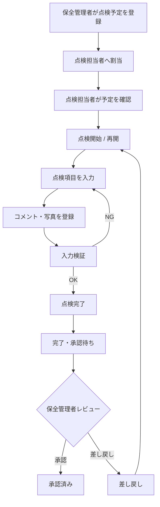
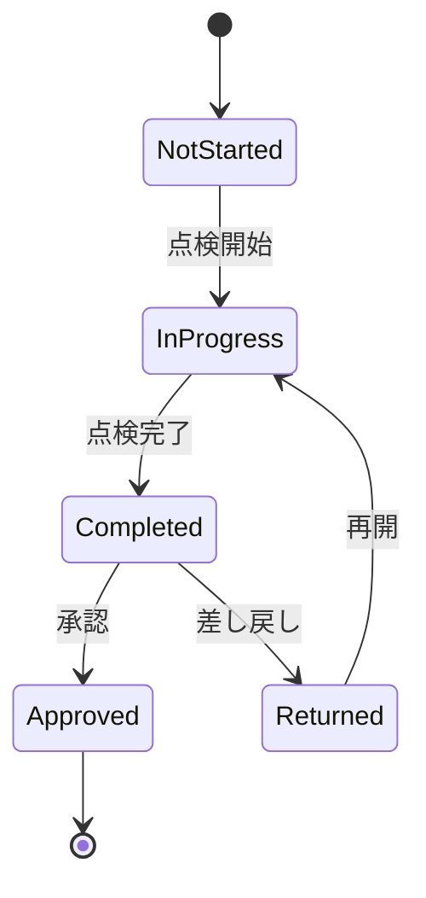

# FacilityInspection 要件定義書

| 項目 | 内容 |
|---|---|
| 文書名 | FacilityInspection 要件定義書 |
| 対象システム | 設備点検・保守記録アプリ FacilityInspection |
| 対象版 | Desktop版（現行実装基準） |
| 文書版 | 1.0 |
| 作成日 | 2026-08-21 |
| 技術基盤 | C# / .NET 10 / Avalonia UI / EF Core / SQLite |
| 文書位置付け | 現行README・ソースコード・既存要素設計書を基に、実装済み仕様を正として再構成した要件定義 |

---

## 1. 文書目的

本書は、工場設備の日常点検をローカル端末上で管理する「FacilityInspection」の業務要件、機能要件、データ要件、非機能要件および対象範囲を定義することを目的とする。

本書を、以後作成する基本設計書および詳細設計書の基準文書とする。

本書に記載する要件は、現行の「FacilityInspection」の実装内容を基礎とし、現行ソースコード、README、ER図、画面遷移図およびスクリーンショットとの整合性を考慮して定義する。

なお、現行実装に含まれない機能については本システムの対象外とし、必要に応じて将来拡張として別途検討する。


---

## 2. システム概要

### 2.1 システムの目的

FacilityInspectionは、工場のユーティリティ・付帯設備に対する日常点検について、以下の情報を一連の業務フローとして管理することを目的とする。

- どの設備を、いつ点検するか
- 誰が点検を担当するか
- どの点検票テンプレートを使用するか
- 各点検項目にどのような結果を入力したか
- 異常が存在したか
- 写真による証跡が存在するか
- 点検が完了したか
- 保全管理者が承認したか、差し戻したか
- 主要操作の履歴を追跡できるか

個別のCRUD画面だけで管理するのではなく、**点検予定 → 点検実施 → 結果・写真保存 → 完了 → 承認／差し戻し**という業務の流れを中心に管理する。

### 2.2 システムの位置付け

本システムは設備を直接制御する制御システムではなく、点検・記録・確認を行う業務支援アプリケーションである。

以下は対象外とする。

- PLC通信
- リアルタイム制御
- センサー値の常時収集
- 製造装置の動作制御
- 安全PLC等の安全制御

### 2.3 対象設備

設備種別として、現行実装では以下を扱える。

| 種別 | 列挙値 | 備考 |
|---|---:|---|
| エアコンプレッサー | 1 | シードデータ・標準点検票あり |
| 冷却水ポンプ | 2 | シードデータ・標準点検票あり |
| 換気設備 | 3 | シードデータ・標準点検票あり |
| 集塵設備 | 4 | 種別定義あり |
| その他 | 99 | 汎用種別 |

デモ用初期データには、第1工場・第2工場と複数の設置場所、エアコンプレッサー・冷却水ポンプ・換気設備が登録される。

---

## 3. 利用者と利用形態

### 3.1 利用ロール

| ロール | システム上の名称 | 主な役割 |
|---|---|---|
| 点検担当者 | `Inspector` | 自分に割り当てられた点検予定を確認し、点検結果・コメント・写真を登録して点検を完了する |
| 保全管理者 | `MaintenanceManager` | 点検状況を管理し、点検予定・設備・テンプレート・担当者を管理し、点検結果の承認／差し戻し、操作履歴確認、バックアップ／復元を行う |

### 3.2 利用形態

- Desktopアプリケーションとして利用する。
- アプリケーションデータは端末ローカルのSQLiteへ保存する。
- サーバー接続を必須としない。
- 現行版では複数端末間のデータ同期を行わない。
- 認証はローカルSQLiteに登録された担当者情報を利用する。

### 3.3 初期利用者

デモ用シードでは以下の構成を持つ。

- 保全管理者：1名
- 点検担当者：5名

本番相当の運用では担当者管理画面から追加・編集・有効／無効の変更を行える。

---

## 4. 対象業務

### 4.1 点検予定管理

保全管理者は、以下を指定して点検予定を作成する。

- 点検予定日
- 工場
- 設置場所
- 設備
- 点検票テンプレート
- 点検担当者
- 備考

予定登録時には、設備・テンプレート・担当者が現在利用可能な状態であることを確認する。

### 4.2 点検実施

点検担当者は自分に割り当てられた予定をカレンダーまたは点検一覧から確認する。対象予定を選択すると点検を開始または再開し、テンプレートに定義された項目へ入力する。

入力形式は以下とする。

- 正常／異常
- 実施／未実施
- 数値
- テキスト

点検項目には任意でコメントおよび写真を登録できる。

### 4.3 異常判定

異常判定は点検結果からシステムが算出する。

- 正常／異常：否定側（異常）を選択した場合に異常
- 実施／未実施：否定側（未実施）を選択した場合に異常
- 数値：テンプレートの最小値未満、または最大値超過の場合に異常
- テキスト：入力内容のみでは自動的に異常扱いにしない

### 4.4 点検完了

必須項目の入力検証に成功した場合、点検担当者は点検を完了できる。完了後の状態は「完了・承認待ち」とする。

### 4.5 承認・差し戻し

保全管理者は完了済み点検の詳細、点検結果、異常件数、登録写真を確認し、次のいずれかを行う。

- 承認：点検結果を確定し、状態を「承認済み」とする。
- 差し戻し：理由を入力し、点検担当者へ修正対象として返却する。

差し戻された点検は点検担当者が再度開始し、再入力後に完了できる。

### 4.6 管理業務

保全管理者は以下を管理する。

- 設備台帳
- 点検予定
- 点検票テンプレート
- 担当者
- 点検実施状況
- 未実施一覧
- 異常一覧
- 完了・承認待ち一覧
- 操作履歴
- データベースバックアップ／復元

---

## 5. 業務フロー



---

## 6. 機能要件

### 6.1 共通機能

| ID | 機能 | 要件 |
|---|---|---|
| COM-001 | ローカルログイン | ログインID・パスワードでSQLite上の担当者を認証する |
| COM-002 | ロール判定 | 認証成功後、ロールに応じて点検担当者画面または保全管理者画面へ遷移する |
| COM-003 | ログアウト | ログアウト確認後、セッションを破棄しログイン画面へ戻る |
| COM-004 | エラー表示 | Repository／Service等で発生した業務エラーを画面上に表示する |

### 6.2 点検担当者機能

| ID | 機能 | 要件 |
|---|---|---|
| MEM-001 | 担当予定カレンダー | 自分に割り当てられた月単位の点検予定を表示する |
| MEM-002 | 日別予定表示 | 選択した日の自分の点検予定を表示する |
| MEM-003 | 担当点検一覧 | 自分の点検予定をページング表示する |
| MEM-004 | 点検開始 | 未実施または差し戻しの点検を開始する |
| MEM-005 | 点検再開 | 自分が実施中の点検を再度開く |
| MEM-006 | 点検入力 | テンプレート項目に応じた入力UIを表示する |
| MEM-007 | 必須検証 | 必須項目が未入力の場合、完了できない |
| MEM-008 | 数値検証 | 数値項目へ不正な形式が入力された場合、完了できない |
| MEM-009 | 異常自動判定 | 選択値または数値基準から異常を判定する |
| MEM-010 | コメント入力 | 項目ごとにコメントを入力できる |
| MEM-011 | 写真登録 | 項目ごとに写真を登録できる |
| MEM-012 | 点検完了確認 | 完了前に確認ダイアログを表示する |
| MEM-013 | 点検完了 | 入力結果・写真を保存し、状態をCompletedへ変更する |

### 6.3 保全管理者機能

| ID | 機能 | 要件 |
|---|---|---|
| ADM-001 | ダッシュボード | 本日の予定、未実施、承認待ち、異常件数および進捗を表示する |
| ADM-002 | 点検実施状況 | 全点検の状態、結果件数、異常件数、写真件数を一覧表示する |
| ADM-003 | 点検詳細 | 点検基本情報、項目別結果、コメント、写真を表示する |
| ADM-004 | 未実施一覧 | 未実施の点検予定を確認する |
| ADM-005 | 異常一覧 | 異常と判定された点検結果を項目単位で表示する |
| ADM-006 | 承認待ち一覧 | Completed状態の点検を一覧表示する |
| ADM-007 | 承認 | Completed状態の点検をApprovedへ変更する |
| ADM-008 | 差し戻し | 理由を入力してCompleted状態をReturnedへ変更する |
| ADM-009 | 設備登録 | 工場・設置場所・設備コード・名称・種別を指定して設備を登録する |
| ADM-010 | 点検票テンプレート一覧 | テンプレートと項目を表示する |
| ADM-011 | 点検票テンプレート作成 | 設備種別、名称、項目、入力形式、単位、基準値、必須、有効状態を登録する |
| ADM-012 | 点検票テンプレート編集 | 既存テンプレート項目を編集する |
| ADM-013 | テンプレート有効切替 | テンプレートの有効／無効を変更する |
| ADM-014 | 点検予定カレンダー | 月単位で点検予定と状態を表示する |
| ADM-015 | 点検予定作成 | 予定日・設備・テンプレート・担当者・備考を登録する |
| ADM-016 | 点検予定編集 | 未実施状態の点検予定のみ編集する |
| ADM-017 | 点検予定取消 | 未実施状態の点検予定のみ取消する |
| ADM-018 | 担当者一覧 | ログインID、表示名、ロール、有効状態、最終ログインを表示する |
| ADM-019 | 担当者登録 | 新規担当者を作成し、パスワードをハッシュ化して保存する |
| ADM-020 | 担当者編集 | ログインID、表示名、ロール、必要に応じてパスワードを変更する |
| ADM-021 | 担当者有効切替 | 担当者の有効／無効を切り替える |
| ADM-022 | 操作履歴 | 操作者・操作種別・対象種別・対象ID・理由を一覧表示する |
| ADM-023 | 操作履歴フィルター | キーワード・操作種別・対象種別で絞り込む |
| ADM-024 | DBバックアップ | 現在のSQLite DBをユーザー指定の`.db`ファイルへバックアップする |
| ADM-025 | DB復元 | 選択した`.db`を検証後に現在DBへ復元する |
| ADM-026 | 復元安全退避 | 復元前の現在DBを自動退避し、復元失敗時はロールバックを試みる |

---

## 7. 権限要件

| 機能 | 点検担当者 | 保全管理者 |
|---|:---:|:---:|
| ログイン／ログアウト | ○ | ○ |
| 自分の点検予定確認 | ○ | - |
| 自分の点検一覧 | ○ | - |
| 点検入力・写真登録 | ○ | - |
| 点検完了 | ○ | - |
| ダッシュボード | × | ○ |
| 全点検実施状況 | × | ○ |
| 未実施一覧 | × | ○ |
| 異常一覧 | × | ○ |
| 承認／差し戻し | × | ○ |
| 設備台帳管理 | × | ○ |
| 点検票テンプレート管理 | × | ○ |
| 点検予定管理 | × | ○ |
| 担当者管理 | × | ○ |
| 操作履歴 | × | ○ |
| バックアップ／復元 | × | ○ |

ロール別の画面分離は、ログイン後に生成するShell ViewModelを切り替えることで実現する。

---

## 8. 業務ルール

### 8.1 認証

- ログインIDは前後空白を除去し、大文字化した正規化IDで照合する。
- 無効化された担当者はログインできない。
- パスワードは平文保存せず、ASP.NET Core IdentityのPasswordHasherでハッシュ化する。
- 認証成功時は最終ログイン日時を更新する。
- 認証失敗時は、利用者の存在有無を特定できない共通エラーメッセージを表示する。

### 8.2 担当者管理

- ログインIDはシステム内で一意とする。
- 有効な保全管理者を0名にする操作は禁止する。
- 編集時、パスワードを変更しない場合は空欄を許可する。
- 画面上のパスワード要件は8文字以上を基本とする。

### 8.3 点検予定

- 予定日は必須とする。
- 新規登録・編集時に過去日を指定できない。
- 同一設備・同一日付の有効な点検予定は重複登録できない。
- 使用できる設備は`InService`のみとする。
- 使用できるテンプレートは有効なもののみとする。
- 設備種別とテンプレートの設備種別は一致しなければならない。
- 担当者は有効な`Inspector`でなければならない。
- 点検開始後の予定は編集・取消できない。
- 取消は物理削除ではなく`IsCancelled`で保持する。

### 8.4 点検状態

点検状態は以下とする。

| 値 | 状態 | 意味 |
|---:|---|---|
| 1 | NotStarted | 未実施 |
| 2 | InProgress | 実施中 |
| 3 | Completed | 完了・承認待ち |
| 4 | Returned | 差し戻し |
| 5 | Approved | 承認済み |

許可する主な遷移は以下とする。



### 8.5 点検入力

- テンプレートの有効項目を表示順に表示する。
- 点検画面を開いてから完了するまでにテンプレート構成が変更された場合、整合性保護のため完了を拒否する。
- 同一テンプレート項目の結果は1点検につき1件とする。
- 入力形式と異なる値種別が送信された場合は保存しない。
- 必須項目は入力必須とする。

### 8.6 写真

- 写真本体はアプリ専用データ領域に保存する。
- DBにはアプリ専用領域からの相対パスを保存する。
- 相対パスに絶対パス、ドライブ指定、`..`による上位参照を許可しない。
- 点検項目に紐づく写真を保存できる。
- 同一完了処理内で同じ写真パスを重複指定できない。

### 8.7 承認・差し戻し

- 承認可能なのはCompleted状態のみとする。
- 差し戻し可能なのはCompleted状態のみとする。
- 差し戻し理由は必須、500文字以内とする。
- 承認・差し戻し時にレビュー日時をUTCで保存する。

### 8.8 バックアップ・復元

- バックアップ形式はSQLite DBファイル（`.db`）とする。
- バックアップはSQLite Backup APIを利用し、一時DBを経由して保存先へコピーする。
- 復元前に`PRAGMA integrity_check`で整合性を確認する。
- 復元対象には少なくとも`Operators`、`InspectionSchedules`、`Inspections`、`AuditLogs`テーブルが必要である。
- 復元前の現在DBは`restore-safety`フォルダーへ自動退避する。
- 復元後にも整合性を再検証する。
- 復元に失敗した場合は安全退避DBからの復旧を試みる。

---

## 9. データ要件

### 9.1 主要エンティティ

| エンティティ | 役割 |
|---|---|
| FactorySite | 工場・拠点 |
| Location | 工場内の設置場所 |
| Equipment | 点検対象設備 |
| Operator | 点検担当者／保全管理者 |
| InspectionTemplate | 設備種別ごとの点検票 |
| InspectionTemplateItem | 点検票内の点検項目 |
| InspectionSchedule | 予定日・設備・テンプレート・担当者を紐づけた予定 |
| Inspection | 点検実施状態・実施者・完了／レビュー情報 |
| InspectionResult | 点検項目ごとの実施結果 |
| InspectionPhoto | 点検結果へ紐づく写真メタ情報 |
| AuditLog | 主要操作の監査情報 |

### 9.2 データ関係

```text
FactorySite
  └─ Location
      └─ Equipment
          └─ InspectionSchedule
              └─ Inspection
                  ├─ InspectionResult
                  │   └─ InspectionPhoto
                  └─ InspectionPhoto

InspectionTemplate
  └─ InspectionTemplateItem
      └─ InspectionResult

Operator
  ├─ InspectionSchedule
  ├─ Inspection
  └─ AuditLog
```

### 9.3 履歴保持

- 点検予定と点検実績を分離して保持する。
- 点検結果側に実施時点の項目名・入力形式・単位を保持し、テンプレート変更後も過去結果を再現できる構成とする。
- 取消済み予定は削除せず状態として保持する。
- 操作履歴は監査ログとして保持する。

---

## 10. 非機能要件

### 10.1 稼働環境

- .NET 10を利用する。
- Avalonia UIによるDesktopアプリケーションとする。
- Windows Desktopを主対象とする。
- メインウィンドウは1200×800を標準サイズとし、最小1000×650とする。

### 10.2 オフライン性

- 通常の点検・管理処理に外部API接続を必須としない。
- DBは端末ローカルに保存する。
- 写真も端末ローカルに保存する。

### 10.3 データ保存

Windows環境では、DBを次のアプリケーションデータ領域に保存する。

```text
%LOCALAPPDATA%\FacilityInspection\facility-inspection.db
```

写真は同一アプリケーション領域配下の`photos`フォルダーへ保存する。

### 10.4 セキュリティ

- パスワードはハッシュ化して保存する。
- 無効ユーザーのログインを拒否する。
- ロール別に利用画面を分離する。
- ファイル保存では相対パスを検証し、ディレクトリトラバーサルを防止する。
- 復元DBは整合性と必須テーブルを検証する。

なお、現行版はローカル単体運用を前提としており、ネットワーク通信暗号化、サーバー認証、集中監査等は対象外である。

### 10.5 信頼性・保全性

- SQLiteバックアップAPIを使用して整合性のあるバックアップを作成する。
- 復元前に安全退避を行う。
- 復元失敗時は自動ロールバックを試みる。
- Repository／Service／ViewModelを分離し、テスト可能性を確保する。
- 主要なDomain／Service／ViewModelにxUnit単体テストを用意する。
- GitHub ActionsでRestore／Release Build／Unit Testを自動実行できる構成とする。

### 10.6 性能

現行資料には数値SLAは定義されていない。対象は端末内SQLiteを利用する小～中規模の点検業務とし、一覧画面では必要に応じてページングを利用する。

現行UIの主なページサイズは以下である。

- 点検実施状況：5件／ページ
- 異常一覧：5件／ページ
- 未実施一覧：5件／ページ
- 点検担当者の点検一覧：5件／ページ
- 操作履歴：10件／ページ

### 10.7 操作性

- 点検担当者と保全管理者でメニューを分離する。
- カレンダーから日付と予定を直感的に選択できること。
- 完了、差し戻し、復元、ログアウト等の重要操作は確認UIを設けること。
- 入力エラーは対象項目付近および画面全体のメッセージで確認できること。
- 読込中、処理中、空データ、例外発生をそれぞれ画面上で判別できること。

---

## 11. 対象範囲

### 11.1 現行版の正式対象

- Desktopアプリ
- ローカルログイン
- ロール別ナビゲーション
- 工場・設置場所・設備データ
- 設備台帳登録・一覧
- 点検票テンプレート管理
- 点検予定カレンダー・予定登録／編集／取消
- 点検担当者向け予定確認・点検一覧
- 点検開始／再開
- チェック・数値・テキスト入力
- コメント
- 点検写真
- 異常自動判定
- 点検完了
- 点検実施状況・詳細
- 未実施一覧
- 異常一覧
- 完了・承認待ち
- 承認／差し戻し
- 担当者管理
- 操作履歴
- SQLiteバックアップ／復元
- 単体テスト
- CI

### 11.2 現行版の対象外

既存の初期構想に存在するが、現行実装には含めないものを以下とする。

- Android版
- iOS／Browser版
- クラウド同期
- ASP.NET Core Web API
- 複数端末の同時編集
- 自動同期・競合解決
- CSV出力
- PDF帳票出力
- 異常案件を独立エンティティとして管理するワークフロー
- 応急対応・修理・部品交換の専用記録
- 再点検依頼／再点検専用フロー
- 設備仕様項目を汎用定義するSpecificationDefinition／EquipmentSpecification
- 法定点検判定
- PLC／センサー連携

### 11.3 将来拡張候補

対象外機能を将来追加する場合は、本書の要件を変更管理したうえで追加する。特にクラウド同期やAndroid対応を行う場合、ローカル単一DB前提、ファイル保存、認証、競合制御、バックアップ方式を再設計する必要がある。

---

## 12. 受入条件

### 12.1 認証・権限

- 有効な点検担当者でログインすると点検担当者Shellへ遷移する。
- 有効な保全管理者でログインすると管理者Shellへ遷移する。
- 誤った認証情報または無効ユーザーではログインできない。

### 12.2 点検予定

- 保全管理者が有効な設備・テンプレート・点検担当者を選択して予定を登録できる。
- 同一設備・同一日の重複予定を登録できない。
- 過去日へ新規予定を登録できない。
- 点検開始後の予定を編集・取消できない。

### 12.3 点検実施

- 担当者以外は対象点検を開始できない。
- 必須項目が未入力の場合、完了できない。
- 数値項目へ非数値を入力した場合、完了できない。
- 基準範囲外の数値または否定選択が異常として記録される。
- 完了後はCompleted状態となる。

### 12.4 承認

- Completed状態のみ承認または差し戻しできる。
- 差し戻し時は理由が必須である。
- 承認後はApproved状態となる。
- 差し戻し後はReturned状態となり、担当者が再開できる。

### 12.5 バックアップ／復元

- 現在DBを`.db`ファイルとして保存できる。
- 不正なSQLite DBまたは必要テーブルを持たないDBを復元できない。
- 復元前に現在DBが安全退避される。
- 復元成功後に画面データが再構築される。

---

## 13. 前提・制約

- 本書はポートフォリオ用プロジェクトの現行実装を仕様化したものであり、実在顧客の契約要件・法規要件・SLAを示すものではない。
- 数値性能目標、保存年限、監査ログ保持年数、DB最大容量、写真容量上限、パスワード複雑性の詳細ポリシーは現行資料では確定していない。
- これらを実運用へ展開する場合は、利用組織の運用規程に合わせて追加定義する。

---

## 14. 参照資料

- `README.md`
- `docs/images/er-diagram.png`
- `docs/images/member-screen-flow.png`
- `docs/images/admin-screen-flow.png`
- `FacilityInspection/FacilityInspection/Domain/`
- `FacilityInspection/FacilityInspection/Data/`
- `FacilityInspection/FacilityInspection/Services/`
- `FacilityInspection/FacilityInspection/ViewModels/`
- `FacilityInspection/FacilityInspection/Views/`
- `FacilityInspection/FacilityInspection.Tests/`

---

## 15. 変更履歴

| 版 | 日付 | 内容 |
|---|---|---|
| 1.0 | 2026-08-21 | 現行Desktop実装を基準として要件定義を新規作成 |
