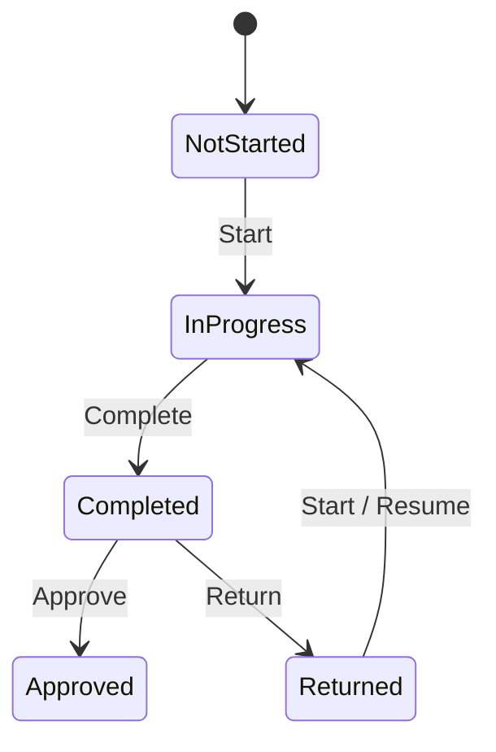
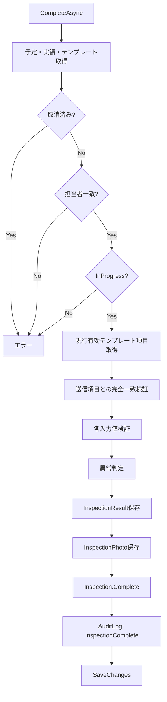
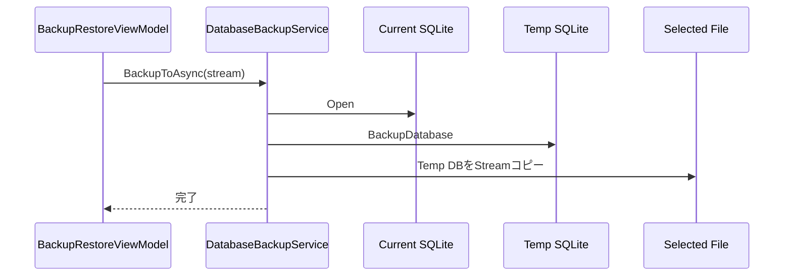

# FacilityInspection 詳細設計書

| 項目 | 内容 |
|---|---|
| 文書名 | FacilityInspection 詳細設計書 |
| 対象システム | 設備点検・保守記録アプリ FacilityInspection |
| 基準文書 | `FacilityInspection_要件定義書.md` / `FacilityInspection_基本設計書.md` |
| 対象版 | Desktop版（現行実装基準） |
| 文書版 | 1.0 |
| 作成日 | 2026-08-21 |
| 実装基盤 | C# / .NET 10 / Avalonia UI / CommunityToolkit.Mvvm / EF Core / SQLite |

---

## 1. 目的

本書は、FacilityInspection要件定義書および基本設計書で定義した仕様について、現行ソースコードを基準として、クラス構成、ドメインルール、物理データ項目、Repository / Serviceの処理、ViewModelの責務、画面操作、入力検証、状態遷移、ファイル保存、バックアップ／復元およびテスト観点を実装可能な粒度で定義する。

本書の記載優先順位は次のとおりとする。

1. 要件定義書で確定した業務要件・対象範囲
2. 基本設計書で確定した外部仕様・方式
3. 現行ソースコードに実装されている内部仕様

現行コードに設計意図との不整合が確認できる箇所は、仕様として追認せず、「実装整合性レビュー」に要修正候補として記載する。

---

## 2. 対象プロジェクト構成

```text
FacilityInspection/
├─ FacilityInspection.slnx
├─ Directory.Packages.props
│
├─ FacilityInspection.Desktop/
│  ├─ Program.cs
│  └─ FacilityInspection.Desktop.csproj
│
├─ FacilityInspection/
│  ├─ App.axaml
│  ├─ App.axaml.cs
│  ├─ FacilityInspection.csproj
│  ├─ Data/
│  │  ├─ Configurations/
│  │  ├─ Seeds/
│  │  ├─ InspectionDbContext.cs
│  │  ├─ InspectionDbContextFactory.cs
│  │  ├─ AuditLogRepository.cs
│  │  ├─ EquipmentRepository.cs
│  │  ├─ InspectionRepository.cs
│  │  ├─ InspectionTemplateRepository.cs
│  │  ├─ OperatorRepository.cs
│  │  ├─ ScheduleRepository.cs
│  │  └─ InspectionPhotoStorage.cs
│  ├─ Domain/
│  │  ├─ AuditLogs/
│  │  ├─ Common/
│  │  ├─ Equipments/
│  │  ├─ Inspections/
│  │  ├─ InspectionTemplates/
│  │  ├─ Locations/
│  │  ├─ Operators/
│  │  └─ Sites/
│  ├─ Services/
│  │  ├─ Authentication/
│  │  └─ Backup/
│  ├─ ViewModels/
│  └─ Views/
│
└─ FacilityInspection.Tests/
   ├─ Domain/
   ├─ Services/
   └─ ViewModels/
```

### 2.1 プロジェクト責務

| プロジェクト | 責務 |
|---|---|
| `FacilityInspection.Desktop` | Desktopアプリケーションのエントリポイント |
| `FacilityInspection` | UI、ViewModel、業務ロジック、データアクセス、サービス、ドメインモデル |
| `FacilityInspection.Tests` | Domain / Service / ViewModelの単体テスト |

### 2.2 主要パッケージ

| パッケージ | 用途 |
|---|---|
| Avalonia | Desktop UI |
| Avalonia.Themes.Fluent | Fluentテーマ |
| Avalonia.Fonts.Inter | UIフォント |
| CommunityToolkit.Mvvm | ObservableProperty / RelayCommand等のMVVM支援 |
| Microsoft.EntityFrameworkCore.Sqlite | SQLite ORM |
| Microsoft.Extensions.Identity.Core | パスワードハッシュ／照合 |
| xUnit | 単体テスト |
| coverlet.collector | カバレッジ収集 |

---

## 3. 起動・初期化設計

### 3.1 Desktop起動

`FacilityInspection.Desktop/Program.cs`からAvaloniaアプリケーションを構築し、Classic Desktop Lifetimeで起動する。

```text
Program.Main
  ↓
BuildAvaloniaApp
  ↓
App.Initialize
  ↓
App.OnFrameworkInitializationCompleted
  ↓
MainWindow生成
```

### 3.2 ローカルデータ配置

アプリケーションデータはユーザーのLocalApplicationData配下を基準とする。

```text
<LocalApplicationData>/FacilityInspection/
├─ facility-inspection.db
├─ photos/
│  └─ ...
└─ restore-safety/
   └─ facility-inspection_before_restore_yyyyMMdd_HHmmss.db
```

SQLite DBの既定ファイル名は`facility-inspection.db`とする。

### 3.3 DB初期化

起動時は以下の順序でDBおよびデモデータを初期化する。

1. `InspectionDbContextFactory`生成
2. `InspectionDbContext.Database.EnsureCreated()`
3. 担当者シード
4. 工場／設置場所シード
5. 設備シード
6. 点検表テンプレートシード
7. 点検予定シード
8. 点検実績・結果・写真シード
9. 操作履歴シード
10. Repository / Service / ViewModel生成
11. `MainWindow`表示

シード処理は参照先データを必要とするため、上記依存順序を維持する。

---

## 4. 共通ドメイン設計

### 4.1 EntityBase

**ソース:** `Domain/Common/EntityBase.cs`

全主要エンティティの基底として識別子と作成・更新日時を保持する。

| プロパティ | 型 | 内容 |
|---|---|---|
| `Id` | `Guid` | エンティティ識別子 |
| `CreatedAtUtc` | `DateTimeOffset` | 作成日時 |
| `UpdatedAtUtc` | `DateTimeOffset?` | 最終更新日時 |

`MarkUpdated()`を実行した時点で`UpdatedAtUtc`を更新する。

### 4.2 ID方針

- 主キーは`Guid`を使用する。
- 外部キーも対応するエンティティの`Guid`を保持する。
- `Guid.Empty`は有効な業務IDとして扱わない。

### 4.3 日時方針

- エンティティの作成・更新・点検実施・承認等の時刻は`DateTimeOffset`を使用する。
- 点検予定日は時刻を持たないため`DateOnly`を使用する。
- UI上の「今日」との比較は、テスト可能な箇所ではClock相当の注入値を利用する。

---

## 5. 列挙型設計

### 5.1 OperatorRole

| 値 | 数値 | 用途 |
|---|---:|---|
| `Inspector` | 1 | 点検担当者 |
| `MaintenanceManager` | 2 | 保全管理者 |

### 5.2 EquipmentType

| 値 | 数値 | 用途 |
|---|---:|---|
| `AirCompressor` | 1 | エアコンプレッサー |
| `CoolingWaterPump` | 2 | 冷却水ポンプ |
| `Ventilation` | 3 | 換気設備 |
| `DustCollector` | 4 | 集塵設備 |
| `Other` | 99 | その他 |

### 5.3 EquipmentStatus

| 値 | 数値 | 用途 |
|---|---:|---|
| `InService` | 1 | 稼働中 |
| `UnderMaintenance` | 2 | 保全中 |
| `Suspended` | 3 | 停止中 |
| `Retired` | 4 | 廃止 |

### 5.4 InspectionInputType

| 値 | 数値 | 入力方式 |
|---|---:|---|
| `NormalAbnormal` | 1 | 正常／異常 |
| `DoneNotDone` | 2 | 実施／未実施 |
| `Numeric` | 3 | 数値 |
| `Text` | 4 | 自由入力 |

### 5.5 InspectionStatus

| 値 | 数値 | 意味 |
|---|---:|---|
| `NotStarted` | 1 | 未実施 |
| `InProgress` | 2 | 実施中 |
| `Completed` | 3 | 完了・承認待ち |
| `Returned` | 4 | 差し戻し |
| `Approved` | 5 | 承認済み |

### 5.6 AuditActionType

| 値 | 数値 |
|---|---:|
| `Create` | 1 |
| `Update` | 2 |
| `Delete` | 3 |
| `Cancel` | 4 |
| `InspectionStart` | 10 |
| `InspectionComplete` | 11 |
| `Approve` | 20 |
| `ReturnForCorrection` | 21 |
| `Login` | 30 |
| `Logout` | 31 |
| `Backup` | 40 |
| `Restore` | 41 |

### 5.7 AuditEntityType

| 値 | 数値 |
|---|---:|
| `Inspection` | 1 |
| `InspectionSchedule` | 2 |
| `Equipment` | 3 |
| `InspectionTemplate` | 4 |
| `Operator` | 5 |
| `Database` | 90 |
| `System` | 99 |

---

## 6. ドメインエンティティ詳細

### 6.1 FactorySite

**ソース:** `Domain/Sites/FactorySite.cs`

| 項目 | 仕様 |
|---|---|
| Code | 必須、最大20文字、大文字へ正規化 |
| Name | 必須、最大100文字 |
| Description | 任意、最大500文字 |
| IsActive | 有効／無効 |

主な操作は名称等の更新、有効化、無効化とする。

### 6.2 Location

**ソース:** `Domain/Locations/Location.cs`

| 項目 | 仕様 |
|---|---|
| FactorySiteId | 必須 |
| Code | 必須、最大30文字、大文字へ正規化 |
| Name | 必須、最大100文字 |
| Floor | 任意、最大20文字 |
| Description | 任意、最大500文字 |
| IsActive | 有効／無効 |

同一工場内でLocation Codeが重複しないことをDB制約でも保証する。

### 6.3 Equipment

**ソース:** `Domain/Equipments/Equipment.cs`

| 項目 | 仕様 |
|---|---|
| LocationId | 必須 |
| EquipmentCode | 必須、最大30文字、大文字正規化 |
| Name | 必須、最大100文字 |
| EquipmentType | 設備種別 |
| Manufacturer | 任意、最大100文字 |
| ModelNumber | 任意、最大100文字 |
| SerialNumber | 任意、最大100文字 |
| InstalledOn | 任意 |
| Status | 初期値`InService` |
| Notes | 任意、最大1000文字 |

#### 6.3.1 設備状態操作

| メソッド | 遷移 |
|---|---|
| `StartMaintenance()` | `InService/Suspended`等 → `UnderMaintenance` |
| `ResumeOperation()` | 保全・停止状態 → `InService` |
| `Suspend()` | → `Suspended` |
| `Retire()` | → `Retired` |

`Retired`となった設備は通常の状態へ直接復帰させない。

### 6.4 Operator

**ソース:** `Domain/Operators/Operator.cs`

| 項目 | 仕様 |
|---|---|
| LoginId | ログインID |
| NormalizedLoginId | 検索・一意性判定用正規化ID |
| DisplayName | 表示名 |
| PasswordHash | Identity PasswordHasherによるハッシュ |
| Role | Inspector / MaintenanceManager |
| IsActive | 利用可否 |
| LastLoginAt | 最終ログイン日時 |

`RecordLogin()`により最終ログイン時刻を更新する。

### 6.5 InspectionTemplate

**ソース:** `Domain/InspectionTemplates/InspectionTemplate.cs`

| 項目 | 仕様 |
|---|---|
| Name | 最大100文字 |
| EquipmentType | 対象設備種別 |
| Version | バージョン、初期1 |
| IsActive | 利用可否 |
| Items | 点検項目群 |

設備種別とバージョンの組合せを一意とする。

### 6.6 InspectionTemplateItem

**ソース:** `Domain/InspectionTemplates/InspectionTemplateItem.cs`

| 項目 | 仕様 |
|---|---|
| InspectionTemplateId | 親テンプレートID |
| ItemName | 最大150文字 |
| InputType | NormalAbnormal / DoneNotDone / Numeric / Text |
| Unit | 最大20文字 |
| MinimumValue | 数値入力下限、任意 |
| MaximumValue | 数値入力上限、任意 |
| DisplayOrder | 表示順 |
| IsRequired | 必須入力か |
| IsActive | 有効項目か |
| Description | 最大500文字 |

### 6.7 InspectionSchedule

**ソース:** `Domain/Inspections/InspectionSchedule.cs`

| 項目 | 仕様 |
|---|---|
| ScheduledDate | 点検予定日 |
| EquipmentId | 設備ID |
| InspectionTemplateId | テンプレートID |
| AssignedOperatorId | 担当点検者ID |
| Notes | 最大500文字 |
| IsCancelled | 取消フラグ |
| Inspection | 実績、最大1件 |

取消済み予定に対する通常更新は禁止する。

### 6.8 Inspection

**ソース:** `Domain/Inspections/Inspection.cs`

| 項目 | 仕様 |
|---|---|
| InspectionScheduleId | 対応予定ID、一意 |
| Status | 点検状態 |
| PerformedByOperatorId | 実施者ID |
| StartedAtUtc | 開始日時 |
| CompletedAtUtc | 完了日時 |
| ReviewedAtUtc | 承認／差戻し日時 |
| ReturnReason | 差戻し理由、最大500文字 |
| Results | 点検項目結果 |
| Photos | 写真 |

#### 6.8.1 状態遷移



#### 6.8.2 Start

- `NotStarted`または`Returned`のみ開始可能。
- 実施者IDを設定する。
- `StartedAtUtc`を設定する。
- 状態を`InProgress`とする。

#### 6.8.3 Complete

- `InProgress`のみ完了可能。
- `CompletedAtUtc`を設定する。
- 状態を`Completed`とする。

#### 6.8.4 Return

- `Completed`のみ差し戻し可能。
- 理由を必須とする。
- 理由は最大500文字。
- `ReviewedAtUtc`を設定する。
- 状態を`Returned`とする。

#### 6.8.5 Approve

- `Completed`のみ承認可能。
- `ReviewedAtUtc`を設定する。
- 状態を`Approved`とする。

### 6.9 InspectionResult

**ソース:** `Domain/Inspections/InspectionResult.cs`

点検実施時のテンプレート項目情報をスナップショットとして保持する。

| 項目 | 内容 |
|---|---|
| InspectionId | 点検実績ID |
| InspectionTemplateItemId | 元テンプレート項目ID |
| DisplayOrder | 実施時点の表示順 |
| ItemName | 実施時点の項目名 |
| InputType | 実施時点の入力種別 |
| Unit | 実施時点の単位 |
| CheckValue | 二値入力結果 |
| NumericValue | 数値入力結果 |
| TextValue | テキスト入力結果 |
| IsAbnormal | 異常判定結果 |
| Comment | コメント |

テンプレートが後日変更されても、過去実績の表示内容が変化しないよう、名称・入力種別・単位等を結果側にも保持する。

### 6.10 InspectionPhoto

**ソース:** `Domain/Inspections/InspectionPhoto.cs`

| 項目 | 仕様 |
|---|---|
| InspectionId | 点検実績ID |
| InspectionResultId | 点検結果ID、任意 |
| RelativePath | 必須、最大500文字 |
| Caption | 任意、最大200文字 |
| DisplayOrder | 0以上 |
| CapturedAtUtc | 登録日時 |

`RelativePath`は以下を禁止する。

- 絶対パス
- `..`による上位ディレクトリ参照
- 空文字

### 6.11 AuditLog

**ソース:** `Domain/AuditLogs/AuditLog.cs`

| 項目 | 内容 |
|---|---|
| OccurredAtUtc | 操作日時 |
| OperatorId | 操作者ID |
| ActionType | 操作種別 |
| EntityType | 対象種別 |
| EntityId | 対象ID |
| BeforeValue | 変更前情報 |
| AfterValue | 変更後情報 |
| Reason | 理由 |

生成後の操作履歴は業務データとして変更しない前提とする。

---

## 7. DB物理設計

### 7.1 InspectionDbContext

**ソース:** `Data/InspectionDbContext.cs`

- SQLite Providerを使用する。
- DBファイルパスをコンストラクタで受け取る。
- Entity Configurationは`ApplyConfigurationsFromAssembly`で一括適用する。

DbSetは以下の11エンティティを持つ。

1. FactorySites
2. Locations
3. Equipments
4. Operators
5. InspectionTemplates
6. InspectionTemplateItems
7. InspectionSchedules
8. Inspections
9. InspectionResults
10. InspectionPhotos
11. AuditLogs

### 7.2 FactorySites

| 列 | CLR型 | 必須 | 制約 |
|---|---|---|---|
| Id | Guid | ○ | PK |
| Code | string | ○ | max 20 / UNIQUE |
| Name | string | ○ | max 100 |
| Description | string? | - | max 500 |
| IsActive | bool | ○ |  |
| CreatedAtUtc | DateTimeOffset | ○ |  |
| UpdatedAtUtc | DateTimeOffset? | - |  |

削除時、配下Locationが存在する場合はRestrictとする。

### 7.3 Locations

| 列 | CLR型 | 必須 | 制約 |
|---|---|---|---|
| Id | Guid | ○ | PK |
| FactorySiteId | Guid | ○ | FK → FactorySites |
| Code | string | ○ | max 30 |
| Name | string | ○ | max 100 |
| Floor | string? | - | max 20 |
| Description | string? | - | max 500 |
| IsActive | bool | ○ |  |
| CreatedAtUtc | DateTimeOffset | ○ |  |
| UpdatedAtUtc | DateTimeOffset? | - |  |

`FactorySiteId + Code`を一意とする。

### 7.4 Equipments

| 列 | CLR型 | 必須 | 制約 |
|---|---|---|---|
| Id | Guid | ○ | PK |
| LocationId | Guid | ○ | FK → Locations |
| EquipmentCode | string | ○ | max 30 / UNIQUE |
| Name | string | ○ | max 100 |
| EquipmentType | EquipmentType | ○ | 文字列保存 / max 40 |
| Manufacturer | string? | - | max 100 |
| ModelNumber | string? | - | max 100 |
| SerialNumber | string? | - | max 100 |
| InstalledOn | DateOnly? | - |  |
| Status | EquipmentStatus | ○ | 文字列保存 / max 40 |
| Notes | string? | - | max 1000 |
| CreatedAtUtc | DateTimeOffset | ○ |  |
| UpdatedAtUtc | DateTimeOffset? | - |  |

インデックス:

- LocationId
- EquipmentType
- Status

### 7.5 Operators

| 列 | CLR型 | 必須 | 制約 |
|---|---|---|---|
| Id | Guid | ○ | PK |
| LoginId | string | ○ | max 50 |
| NormalizedLoginId | string | ○ | max 50 / UNIQUE |
| DisplayName | string | ○ | max 100 |
| PasswordHash | string | ○ | max 512 |
| Role | OperatorRole | ○ | 文字列保存 / max 30 |
| IsActive | bool | ○ |  |
| LastLoginAt | DateTimeOffset? | - |  |
| CreatedAtUtc | DateTimeOffset | ○ |  |
| UpdatedAtUtc | DateTimeOffset? | - |  |

### 7.6 InspectionTemplates

| 列 | CLR型 | 必須 | 制約 |
|---|---|---|---|
| Id | Guid | ○ | PK |
| Name | string | ○ | max 100 |
| EquipmentType | EquipmentType | ○ | 整数保存 |
| Version | int | ○ |  |
| IsActive | bool | ○ |  |
| CreatedAt | DateTimeOffset | ○ | テンプレート業務日時 |
| UpdatedAt | DateTimeOffset? | - | テンプレート業務日時 |
| CreatedAtUtc | DateTimeOffset | ○ | EntityBase |
| UpdatedAtUtc | DateTimeOffset? | - | EntityBase |

`EquipmentType + Version`を一意とする。

子`InspectionTemplateItems`はテンプレート削除時Cascadeとする。

### 7.7 InspectionTemplateItems

| 列 | CLR型 | 必須 | 制約 |
|---|---|---|---|
| Id | Guid | ○ | PK |
| InspectionTemplateId | Guid | ○ | FK |
| ItemName | string | ○ | max 150 |
| InputType | InspectionInputType | ○ | 整数保存 |
| Unit | string? | - | max 20 |
| MinimumValue | double? | - |  |
| MaximumValue | double? | - |  |
| DisplayOrder | int | ○ |  |
| IsRequired | bool | ○ |  |
| IsActive | bool | ○ |  |
| Description | string? | - | max 500 |
| CreatedAtUtc | DateTimeOffset | ○ |  |
| UpdatedAtUtc | DateTimeOffset? | - |  |

`InspectionTemplateId + DisplayOrder`にインデックスを設定する。

### 7.8 InspectionSchedules

| 列 | CLR型 | 必須 | 制約 |
|---|---|---|---|
| Id | Guid | ○ | PK |
| ScheduledDate | DateOnly | ○ |  |
| EquipmentId | Guid | ○ | FK / Restrict |
| InspectionTemplateId | Guid | ○ | FK / Restrict |
| AssignedOperatorId | Guid | ○ | FK / Restrict |
| Notes | string? | - | max 500 |
| IsCancelled | bool | ○ |  |
| CreatedAtUtc | DateTimeOffset | ○ |  |
| UpdatedAtUtc | DateTimeOffset? | - |  |

インデックス:

- ScheduledDate
- EquipmentId + ScheduledDate

Inspectionとは1対0..1とし、Inspection側をCascade対象とする。

### 7.9 Inspections

| 列 | CLR型 | 必須 | 制約 |
|---|---|---|---|
| Id | Guid | ○ | PK |
| InspectionScheduleId | Guid | ○ | FK / UNIQUE |
| Status | InspectionStatus | ○ | 文字列保存 / max 30 |
| PerformedByOperatorId | Guid? | - | FK / Restrict |
| StartedAtUtc | DateTimeOffset? | - |  |
| CompletedAtUtc | DateTimeOffset? | - |  |
| ReviewedAtUtc | DateTimeOffset? | - |  |
| ReturnReason | string? | - | max 500 |
| CreatedAtUtc | DateTimeOffset | ○ |  |
| UpdatedAtUtc | DateTimeOffset? | - |  |

### 7.10 InspectionResults

| 列 | CLR型 | 必須 | 制約 |
|---|---|---|---|
| Id | Guid | ○ | PK |
| InspectionId | Guid | ○ | FK / Cascade |
| InspectionTemplateItemId | Guid | ○ | FK / Restrict |
| DisplayOrder | int | ○ |  |
| ItemName | string | ○ | max 200 |
| InputType | InspectionInputType | ○ |  |
| CheckValue | bool? | - |  |
| NumericValue | decimal? | - | precision 18,4 |
| TextValue | string? | - | max 1000 |
| Unit | string? | - | max 50 |
| IsAbnormal | bool | ○ |  |
| Comment | string? | - | max 1000 |
| CreatedAtUtc | DateTimeOffset | ○ |  |
| UpdatedAtUtc | DateTimeOffset? | - |  |

`InspectionId + InspectionTemplateItemId`を一意とする。

### 7.11 InspectionPhotos

| 列 | CLR型 | 必須 | 制約 |
|---|---|---|---|
| Id | Guid | ○ | PK |
| InspectionId | Guid | ○ | FK / Cascade |
| InspectionResultId | Guid? | - | FK / Restrict |
| RelativePath | string | ○ | max 500 |
| Caption | string? | - | max 200 |
| DisplayOrder | int | ○ |  |
| CapturedAtUtc | DateTimeOffset | ○ |  |
| CreatedAtUtc | DateTimeOffset | ○ |  |
| UpdatedAtUtc | DateTimeOffset? | - |  |

インデックス:

- InspectionId + DisplayOrder
- InspectionResultId

### 7.12 AuditLogs

| 列 | CLR型 | 必須 | 制約 |
|---|---|---|---|
| Id | Guid | ○ | PK |
| OccurredAtUtc | DateTimeOffset | ○ |  |
| OperatorId | Guid | ○ | 操作者 |
| ActionType | AuditActionType | ○ | 整数保存 |
| EntityType | AuditEntityType | ○ | 整数保存 |
| EntityId | Guid | ○ | 対象ID |
| BeforeValue | string? | - | max 4000 |
| AfterValue | string? | - | max 4000 |
| Reason | string? | - | max 1000 |
| CreatedAtUtc | DateTimeOffset | ○ |  |
| UpdatedAtUtc | DateTimeOffset? | - |  |

インデックス:

- OccurredAtUtc
- OperatorId
- ActionType
- EntityType + EntityId

---

## 8. 認証・セッション詳細設計

### 8.1 AuthenticationService

**ソース:** `Services/Authentication/AuthenticationService.cs`

#### SignInAsync

入力:

- Login ID
- Password

処理:

1. Login IDを`Trim()`する。
2. 大文字化した`NormalizedLoginId`を生成する。
3. DBから一致するOperatorを取得する。
4. Operatorが存在しない、または無効の場合は共通の認証失敗を返す。
5. `PasswordHasher`でパスワードを照合する。
6. 不一致の場合は認証失敗を返す。
7. 再ハッシュが必要な場合はPasswordHashを更新する。
8. `LastLoginAt`を更新する。
9. `SignedInOperator`を生成して成功結果を返す。

存在しないLogin IDと無効ユーザーをUI上で区別しすぎず、認証情報の推測を抑える。

### 8.2 AuthenticationResult

成功／失敗を共通形式で返す。

- Success時: `SignedInOperator`
- Failure時: 画面表示用エラーメッセージ

### 8.3 CurrentUserSession

**ソース:** `Services/Authentication/CurrentUserSession.cs`

アプリ起動中のログイン状態をメモリ上で保持する。

| 操作 | 内容 |
|---|---|
| `SignIn` | 現在ユーザーを設定 |
| `SignOut` | 現在ユーザーを解除 |

アプリ再起動後に自動ログイン状態を復元する永続セッション機能は対象外とする。

---

## 9. Repository詳細設計

## 9.1 ScheduleRepository

**ソース:** `Data/ScheduleRepository.cs`

### 9.1.1 主な検索

| 処理 | 内容 |
|---|---|
| 月次予定取得 | 指定月の点検予定を取得 |
| 担当者月次予定取得 | 指定担当者の月次予定を取得 |
| 担当者日次予定取得 | 指定担当者・指定日の予定を取得 |
| 工場取得 | 予定登録用工場候補を取得 |
| 設置場所取得 | 工場配下の候補を取得 |
| 設備取得 | 設置場所配下の候補を取得 |
| テンプレート取得 | 設備種別に対応する有効テンプレートを取得 |
| 点検担当者取得 | 有効なInspectorを取得 |

### 9.1.2 CreateAsync

入力:

- ScheduledDate
- EquipmentId
- InspectionTemplateId
- AssignedOperatorId
- Notes

業務検証:

1. 予定日が過去日でない。
2. 設備が存在し、`InService`である。
3. テンプレートが存在し、有効である。
4. テンプレートのEquipmentTypeが設備のEquipmentTypeと一致する。
5. 担当者が存在し、有効な`Inspector`である。
6. 同一設備・同一予定日の未取消予定が存在しない。

保存:

- `InspectionSchedule`生成
- 対応する`Inspection`を`NotStarted`で生成・関連付け
- SaveChanges

### 9.1.3 UpdateAsync

- 過去日への変更は禁止する。
- 取消済み予定は更新不可。
- 実績状態が`NotStarted`以外の場合は更新不可。
- 設備／テンプレート／担当者についてCreateと同等の整合性検証を行う。

### 9.1.4 CancelAsync

- 取消済みの場合は二重取消を行わない。
- 点検が開始済みの場合は取消不可。
- `NotStarted`の予定のみ取消可能とする。

---

## 9.2 InspectionRepository

**ソース:** `Data/InspectionRepository.cs`

点検開始・完了・承認・差戻し、および点検系一覧／詳細参照を担当する。

### 9.2.1 StartOrResumeAsync

入力:

- scheduleId
- operatorId

処理:

1. 点検予定を設備・テンプレート・点検実績とともに取得する。
2. 予定が存在しない場合はエラー。
3. 取消済みの場合はエラー。
4. `AssignedOperatorId`とoperatorIdが一致しない場合はエラー。
5. 実績が存在しない場合は新規`Inspection`を生成する。
6. `NotStarted`または`Returned`なら`Start`を実行する。
7. `InProgress`なら、同一実施者の場合のみ再開を許可する。
8. `Completed`または`Approved`は再開不可。
9. 点検入力画面用`InspectionEntryData`を返す。

### 9.2.2 CompleteAsync

入力:

- scheduleId
- operatorId
- 入力項目一覧

処理概要:



#### テンプレート整合性検証

点検画面表示後にテンプレート構成が変更された場合の誤登録を防止するため、完了時にDB上の有効項目と送信項目ID集合を照合する。

- 項目不足を許可しない。
- 余分な項目を許可しない。
- 同一テンプレート項目IDの重複を許可しない。

#### 入力種別別検証

| InputType | 必須時 | 異常判定 |
|---|---|---|
| NormalAbnormal | CheckValue必須 | `false`を異常とする |
| DoneNotDone | CheckValue必須 | `false`を異常とする |
| Numeric | NumericValue必須 | 下限未満または上限超過を異常とする |
| Text | TextValue非空 | 自動異常判定なし |

任意項目は値が未設定でも完了可能とする。

#### 結果スナップショット

結果保存時はテンプレート項目から以下を転記する。

- DisplayOrder
- ItemName
- InputType
- Unit

これにより、将来テンプレートが変更されても過去実績を当時の表示内容で参照できる。

### 9.2.3 GetAllAsync / 一覧取得

点検実施状況画面用に、予定・設備・担当者・状態等を一覧データへ整形して返す。

### 9.2.4 GetDetailAsync

点検実施詳細画面用に以下を取得する。

- 予定
- 設備
- 担当者
- 実施状態／日時
- 点検項目結果
- 写真
- 差戻し理由

### 9.2.5 Abnormal一覧

`InspectionResult.IsAbnormal == true`となる結果を対象として、設備・予定・項目情報とともに一覧表示する。

### 9.2.6 GetNotStartedAsync

設計上の未実施判定は以下とする。

```text
予定が取消されていない
AND
(Inspectionが存在しない OR Inspection.Status == NotStarted)
```

※現行コードとの差異は「19. 実装整合性レビュー」を参照。

### 9.2.7 GetApprovalPendingAsync

`Inspection.Status == Completed`を承認待ちとして取得する。

### 9.2.8 ApproveAsync

1. 対象Inspectionを取得する。
2. `Completed`であることを確認する。
3. `Inspection.Approve()`を実行する。
4. `AuditLog(Approve)`を追加する。
5. 保存する。

### 9.2.9 ReturnAsync

1. 対象Inspectionを取得する。
2. `Completed`であることを確認する。
3. 差戻し理由を検証する。
4. `Inspection.Return(reason)`を実行する。
5. `AuditLog(ReturnForCorrection)`を追加する。
6. 保存する。

### 9.2.10 担当点検ページング

- 担当者IDで絞り込む。
- 取消済み予定を除外する。
- 予定日の新しい順を基本とする。
- ViewModel側のページサイズは5件とする。

---

## 9.3 InspectionTemplateRepository

**ソース:** `Data/InspectionTemplateRepository.cs`

### 主な処理

| メソッド | 内容 |
|---|---|
| `GetAllAsync` | テンプレートと項目一覧取得 |
| `CreateAsync` | 新規テンプレート作成 |
| `UpdateAsync` | テンプレート／項目更新 |
| `SetActiveAsync` | 有効／無効切替 |

新規／更新時は点検項目の表示順、名称、入力種別、単位、範囲、必須フラグ等を保存する。

過去結果はInspectionResult側にスナップショットを持つため、テンプレート編集後も実績表示を維持する。

---

## 9.4 OperatorRepository

**ソース:** `Data/OperatorRepository.cs`

### 9.4.1 GetAllAsync

担当者を一覧取得する。

### 9.4.2 CreateAsync

- Login IDを正規化する。
- `NormalizedLoginId`の重複を禁止する。
- PasswordHasherでパスワードをハッシュ化する。
- Role / IsActiveを設定する。

### 9.4.3 UpdateAsync

表示名・ロール等を更新する。Login ID一意性を維持する。

### 9.4.4 SetActiveAsync

有効／無効を切り替える。

保全管理者を無効化またはInspectorへ変更する場合、他に有効なMaintenanceManagerが存在することを確認し、最後の管理者が消える操作を禁止する。

---

## 9.5 EquipmentRepository

**ソース:** `Data/EquipmentRepository.cs`

主に設備管理画面で利用する。

| メソッド | 内容 |
|---|---|
| `InitializeAsync` | 設備管理用データ初期化 |
| `GetDefaultLocationIdAsync` | 登録時の既定設置場所取得 |
| `GetAllAsync` | 設備一覧取得 |
| `AddAsync` | 設備登録 |

現行画面では設備ドメインが保持する全項目・状態操作を完全に編集する管理UIまでは実装対象としていない。

---

## 9.6 AuditLogRepository

**ソース:** `Data/AuditLogRepository.cs`

操作履歴の追加および一覧表示用データ取得を担当する。

検索条件として、期間／文字列／操作種別／対象種別等をViewModelから指定できる構成とする。

---

## 10. 写真保存詳細設計

### 10.1 InspectionPhotoStorage

**ソース:** `Data/InspectionPhotoStorage.cs`

点検写真はDB本体へBLOB保存せず、ローカルファイルとして保存し、DBには相対パスを記録する。

### 10.2 保存パス

```text
photos/
└─ {scheduleId:N}/
   └─ {inspectionTemplateItemId:N}/
      └─ {Guid}{extension}
```

例:

```text
photos/6e.../f1.../9a...jpg
```

### 10.3 拡張子

- 元ファイルの拡張子を正規化する。
- 拡張子長は最大10文字程度に制限する。
- 不正または取得不能な場合は`.img`を使用する。

### 10.4 セキュリティ

相対パスから実体パスを生成する際、以下を拒否する。

- 絶対パス
- `..`によるディレクトリトラバーサル
- 許可された保存ルート外への解決

### 10.5 入力キャンセル時

点検入力画面で選択・コピーした写真が、点検完了前に画面離脱された場合は、未保存写真を削除して不要ファイルを残さない。

---

## 11. バックアップ／復元詳細設計

## 11.1 DatabaseBackupService

**ソース:** `Services/Backup/DatabaseBackupService.cs`

### 11.1.1 推奨バックアップファイル名

```text
facility-inspection_yyyyMMdd_HHmmss.db
```

### 11.1.2 BackupToAsync

単純なDBファイルコピーではなく、SQLite接続を使用してBackup APIで整合性のあるDBイメージを生成し、指定先Streamへコピーする。



### 11.1.3 RestoreFromAsync

復元は破壊的操作のため、次の順序で実行する。

1. 選択されたDBを一時ステージングファイルへコピーする。
2. `PRAGMA integrity_check`でSQLite整合性を検証する。
3. 必須テーブルの存在を確認する。
4. 現在DBを`restore-safety`へ安全退避する。
5. ステージングDBから現在DBへSQLite Backupを実行する。
6. 復元後DBを再検証する。
7. 成功結果と安全退避ファイルパスを返す。
8. 復元途中に失敗した場合は、安全退避DBからの戻しを試行する。

### 11.1.4 必須テーブル検証

最低限、以下のテーブルが存在することを確認する。

- Operators
- InspectionSchedules
- Inspections
- AuditLogs

### 11.1.5 BackupFilePickerService

Avalonia StorageProviderを利用し、バックアップ保存先／復元元をOS標準ファイル選択UIで扱う。

復元対象は`.db`を基本とする。

---

## 12. MainViewModel・ナビゲーション設計

### 12.1 MainViewModel

**ソース:** `ViewModels/MainViewModel.cs`

アプリ全体のルートViewModelとして、現在表示するViewModelを切り替える。

初期表示:

```text
MainViewModel
  └─ LoginViewModel
```

ログイン成功後:

```text
Inspector
  → MemberShellViewModel

MaintenanceManager
  → AdminShellViewModel
```

ログアウト:

1. `CurrentUserSession.SignOut()`
2. LoginViewModelを再生成
3. ルートContentをログイン画面へ切替

### 12.2 MemberShellViewModel

点検担当者用シェル。

主メニュー:

- 点検予定
- 点検一覧
- ログアウト

点検予定／一覧から点検を開始すると`InspectionEntryViewModel`へ遷移する。

### 12.3 AdminShellViewModel

保全管理者用シェル。

主メニュー:

- ダッシュボード
- 点検実施状況
- 異常一覧
- 未実施一覧
- 完了・承認待ち
- 設備管理
- 点検表テンプレート管理
- 点検予定管理
- 担当者管理
- 操作履歴
- バックアップ／復元

一覧から詳細へ進む画面はShellが遷移を仲介する。

DB復元完了時は、復元前に保持していたViewModel／DbContextの状態を使い続けないよう、AdminShellを再生成する。

---

## 13. 画面・ViewModel詳細設計

## 13.1 LoginViewModel

**View:** `Views/LoginView.axaml`

**ViewModel:** `ViewModels/LoginViewModel.cs`

主な状態:

- LoginId
- Password
- IsPasswordVisible
- ErrorMessage
- IsBusy

主なCommand:

- Login
- パスワード表示切替

処理:

1. Login ID / Password入力取得
2. AuthenticationService呼出し
3. 失敗時ErrorMessage表示
4. 成功時CurrentUserSessionへ保存
5. MainViewModelへログイン成功通知

---

## 13.2 MemberDashboardViewModel

**View:** `Views/MemberDashboardView.axaml`

点検担当者向け月間／日次予定画面。

主な機能:

- 前月／翌月移動
- 今日へ移動
- 月間カレンダー構築
- 日付選択
- 選択日の担当予定表示
- 更新
- 点検開始

点検開始時は対象scheduleIdをShellへ通知し、InspectionEntryへ遷移する。

---

## 13.3 MemberInspectionListViewModel

**View:** `Views/MemberInspectionListView.axaml`

担当点検一覧をページング表示する。

| 項目 | 仕様 |
|---|---|
| PageSize | 5 |
| PageNumber | 1開始 |
| TotalCount | 担当予定総数 |
| TotalPages | `ceil(TotalCount / 5)`、最低1 |
| CanPreviousPage | PageNumber > 1かつ非ロード中 |
| CanNextPage | PageNumber < TotalPagesかつ非ロード中 |

Command:

- PreviousPage
- NextPage
- Refresh
- 対象点検の開始／再開

Repository例外時は画面を落とさず`ErrorMessage`へ反映する。

---

## 13.4 InspectionEntryViewModel

**View:** `Views/InspectionEntryView.axaml`

点検実施の中心画面。

### 13.4.1 初期化

`InspectionRepository.StartOrResumeAsync`を呼び出し、以下をロードする。

- 設備名
- 予定日
- テンプレート名
- 差戻し理由
- 点検項目
- 既存結果
- 既存／新規写真

### 13.4.2 InspectionEntryItemViewModel

点検項目1行を表す。

入力種別ごとに表示／入力コントロールを切り替える。

| 入力種別 | UI入力 |
|---|---|
| NormalAbnormal | 正常／異常選択 |
| DoneNotDone | 実施／未実施選択 |
| Numeric | 数値TextBox |
| Text | テキストTextBox |

各項目はCommentと写真を保持できる。

### 13.4.3 数値入力

- 現在カルチャでのdecimal解析を試行する。
- 必要に応じてInvariantCultureも考慮する。
- 数値として解釈できない場合は項目エラーとする。

### 13.4.4 完了確認

完了Commandを直接DB更新へつなげず、確認状態を経由する。

```text
入力
 ↓
ReviewCompletion
 ↓
入力検証
 ↓
完了確認表示
 ├─ CancelCompletion → 入力へ戻る
 └─ ConfirmCompletion
      ↓
   Repository.CompleteAsync
      ↓
   完了表示
      ↓
   FinishCompletion
```

完了後状態は「完了・承認待ち」と表示する。

### 13.4.5 戻る

未完了の新規写真が存在する場合はStorageから削除し、前画面へ戻る。

---

## 13.5 AdminDashboardViewModel

**View:** `Views/AdminDashboardView.axaml`

管理者向けサマリ。

表示対象:

- 本日の予定数
- 未実施数
- 承認待ち数
- 当日の異常件数
- 完了率等

ショートカット操作をAdminShellへ通知し、対象画面へ遷移する。

---

## 13.6 InspectionStatusViewModel

**View:** `Views/InspectionStatusView.axaml`

点検実施状況一覧。

主な機能:

- 一覧取得
- キーワード検索
- 状態フィルタ
- ページング
- 詳細表示

PageSizeは5件を基本とする。

---

## 13.7 InspectionDetailViewModel

**View:** `Views/InspectionDetailView.axaml`

点検結果の参照専用画面。

表示内容:

- 予定／設備情報
- 実施者
- 状態
- 開始／完了／レビュー日時
- 各点検項目の入力結果
- 異常表示
- コメント
- 写真
- 差戻し理由

この画面では点検結果そのものの編集を行わない。

---

## 13.8 AbnormalListViewModel

**View:** `Views/AbnormalListView.axaml`

`InspectionResult.IsAbnormal`を基準に異常結果を一覧化する。

主な機能:

- 検索
- ページング
- 対象点検詳細への遷移

PageSizeは5件を基本とする。

---

## 13.9 NotStartedListViewModel

**View:** `Views/NotStartedListView.axaml`

未実施予定を一覧表示する。

設計上の対象条件:

- 取消されていない
- 点検状態が未実施

主な機能:

- 検索
- ページング
- 予定／設備／担当者確認

PageSizeは5件を基本とする。

---

## 13.10 ApprovalPendingListViewModel

**View:** `Views/ApprovalPendingListView.axaml`

`Inspection.Status == Completed`の点検を承認待ちとして一覧表示する。

対象選択時にApprovalPendingDetailViewModelへ遷移する。

---

## 13.11 ApprovalPendingDetailViewModel

**View:** `Views/ApprovalPendingDetailView.axaml`

管理者が結果内容を確認し、承認または差戻しを行う。

Command:

- Approve
- Return
- Back

承認:

- 確認後`InspectionRepository.ApproveAsync`を呼ぶ。
- 成功後一覧へ戻る。

差戻し:

- ReturnReasonを必須とする。
- `InspectionRepository.ReturnAsync`を呼ぶ。
- 点検状態はReturnedとなり、担当者が再度開始可能になる。

---

## 13.12 ScheduleCalendarViewModel

**View:** `Views/ScheduleCalendarView.axaml`

管理者向け点検予定カレンダー。

主な状態:

- 表示月
- CalendarDays
- 選択日
- 予定一覧
- 登録／編集フォーム状態
- 工場候補
- 設置場所候補
- 設備候補
- テンプレート候補
- Inspector候補

### 13.12.1 候補連動

```text
FactorySite選択
   ↓
Location候補再取得
   ↓
Equipment候補再取得
   ↓
EquipmentTypeに応じたTemplate候補再取得
```

### 13.12.2 登録

入力検証後、`ScheduleRepository.CreateAsync`を呼ぶ。

### 13.12.3 編集

未実施の予定のみ編集可能とする。

### 13.12.4 取消

未実施の予定のみ取消可能とし、物理削除ではなく`IsCancelled`を設定する。

---

## 13.13 EquipmentManagementViewModel

**View:** `Views/EquipmentManagementView.axaml`

現行実装では設備一覧・登録を主対象とする。

登録項目は画面実装に合わせて設備コード、設備名、設備種別等を取り扱う。

Equipmentドメインにはメーカー、型式、製造番号、設置日、状態、備考も保持可能だが、これらの完全なマスタ編集画面は現行UIの正式範囲外とする。

---

## 13.14 InspectionTemplateManagementViewModel

**View:** `Views/InspectionTemplateManagementView.axaml`

点検票テンプレートの一覧、新規作成、編集、有効／無効切替を行う。

点検項目編集:

- 項目名
- 入力種別
- 単位
- 下限／上限
- 表示順
- 必須
- 有効／無効
- 説明

`InspectionTemplateItemEditorViewModel`を編集行として使用し、一覧表示用にRow / ListItem ViewModelを分離する。

---

## 13.15 OperatorManagementViewModel

**View:** `Views/OperatorManagementView.axaml`

担当者の一覧、新規作成、編集、有効／無効切替を行う。

主な入力:

- Login ID
- Display Name
- Password
- Role
- IsActive

パスワードの画面側最低長は8文字とする。

最後の有効なMaintenanceManagerを無効化／降格する操作はRepositoryで拒否する。

---

## 13.16 AuditLogViewModel

**View:** `Views/AuditLogView.axaml`

操作履歴を一覧表示する。

主な絞込:

- キーワード
- ActionType
- EntityType

PageSizeは10件を基本とする。

---

## 13.17 BackupRestoreViewModel

**View:** `Views/BackupRestoreView.axaml`

Command:

- Backup
- Restore用ファイル選択
- Restore確認
- Restore実行

バックアップ成功時:

- `AuditActionType.Backup`
- `AuditEntityType.Database`

を操作履歴へ記録する。

復元成功時:

- `AuditActionType.Restore`
- `AuditEntityType.Database`

を記録する。

復元後は親Shellへ完了通知し、DB依存ViewModelを再生成する。

---

## 14. 共通ViewModel設計

### 14.1 ViewModelBase

各ViewModelの共通基底とする。

CommunityToolkit.MvvmのObservableObject相当の通知機構を利用する。

### 14.2 IsLoading / ErrorMessage

非同期Repository／Service呼出しを行う画面では以下を基本とする。

```text
IsLoading = true
ErrorMessage = null
try
    await Repository/Service
catch Exception ex
    ErrorMessage = 画面向けメッセージ + ex.Message
finally
    IsLoading = false
```

### 14.3 Command二重実行防止

ロード／保存中は操作可能フラグをfalseとし、同じ処理の連続実行を避ける。

### 14.4 計算プロパティ更新

PageNumber、TotalCount、IsLoading等に連動する以下の表示値はPropertyChangedを明示的に通知する。

- TotalPages
- PageText
- CanPreviousPage
- CanNextPage
- IsEmpty
- HasError

---

## 15. 入力バリデーション詳細

### 15.1 共通文字列

- 必須項目はNull／空文字／空白のみを拒否する。
- 保存前に必要に応じてTrimする。
- DB最大長とDomain最大長を一致させる。

### 15.2 点検予定

| 検証 | 条件 |
|---|---|
| 予定日 | 過去日不可 |
| 設備 | 存在し稼働中 |
| テンプレート | 存在・有効・設備種別一致 |
| 担当者 | 存在・有効・Inspector |
| 重複 | 同一設備・同一日の未取消予定不可 |
| 編集 | 未実施のみ |
| 取消 | 未実施のみ |

### 15.3 点検実施

| 入力種別 | 検証 |
|---|---|
| NormalAbnormal | 必須なら選択必須 |
| DoneNotDone | 必須なら選択必須 |
| Numeric | 必須なら数値必須、数値形式チェック |
| Text | 必須なら空白不可 |
| Photo | 保存ルート／相対パス検証 |

### 15.4 差戻し

- 理由必須。
- 最大500文字。

### 15.5 担当者

- Login ID必須。
- 正規化後Login ID一意。
- Display Name必須。
- 新規作成時Password必須。
- UI最低長8文字。
- Role必須。

---

## 16. ページング設計

### 16.1 基本方式

```text
TotalPages = max(1, ceil(TotalCount / PageSize))
Skip = (PageNumber - 1) * PageSize
Take = PageSize
```

### 16.2 画面別件数

| 画面 | PageSize |
|---|---:|
| 担当点検一覧 | 5 |
| 点検実施状況 | 5 |
| 異常一覧 | 5 |
| 未実施一覧 | 5 |
| 操作履歴 | 10 |

一覧によっては全件ロード後にViewModel側で絞り込み・ページングする箇所とRepositoryでページ取得する箇所があるため、将来的な件数増大時はRepository側ページングへの統一を検討する。

---

## 17. 操作履歴詳細設計

### 17.1 操作種別定義

AuditActionTypeにはCRUD、点検開始／完了、承認／差戻し、ログイン／ログアウト、バックアップ／復元を定義する。

### 17.2 現行ランタイムで明示的に記録している主要処理

コード上で主要業務処理から明示的に生成される操作履歴は少なくとも以下である。

- 点検完了 `InspectionComplete`
- 承認 `Approve`
- 差戻し `ReturnForCorrection`
- バックアップ `Backup`
- 復元 `Restore`

列挙型に定義されているすべてのActionが、現行実装の全操作で必ず記録されていることを意味しない。

### 17.3 記録内容

- 操作者
- 日時
- ActionType
- EntityType
- EntityId
- BeforeValue
- AfterValue
- Reason

Before/Afterは必要な操作のみ文字列化して保持する。

---

## 18. 単体テスト詳細方針

### 18.1 対象

現行テストプロジェクトは以下を対象とする。

- Domain
- Authentication Service
- DatabaseBackupService
- ViewModels

### 18.2 Domainテスト

確認項目:

- コンストラクタ入力検証
- 文字列正規化
- 状態遷移
- 不正状態からの操作拒否
- 写真相対パス制約
- EntityBase更新日時

### 18.3 Serviceテスト

Authentication:

- 正常ログイン
- ユーザーなし
- 無効ユーザー
- パスワード不一致
- セッションSignIn/SignOut

Backup:

- 正常バックアップ
- 正常復元
- DB整合性検証
- Stream Positionが末尾の場合の扱い
- 安全退避
- 復元失敗時処理

### 18.4 ViewModelテスト

Repositoryを直接置換しづらいViewModelについては、本番コンストラクタを維持しつつ、`internal`コンストラクタ等からDelegate／Test Doubleを注入可能とする。

検証:

- 初期表示
- Command実行
- 状態変化
- ページング
- 入力検証
- 成功通知
- Repository例外時のErrorMessage
- ロール別遷移

### 18.5 日付依存

「今日」「過去日」等の判定はClockを注入し、テスト実行日に依存しないようにする。

---

## 19. 実装整合性レビュー

本章は、現行実装を設計書へ転記する過程で確認できた「設計意図とコードの差」を記録する。ここに記載する内容は正式要件ではなく、修正候補である。

### 19.1 未実施一覧の抽出条件

**関連:**

- `Data/ScheduleRepository.cs`
- `Data/InspectionRepository.cs`

ScheduleRepositoryの新規予定作成では、`InspectionSchedule`と同時に`Inspection(Status = NotStarted)`を生成して関連付ける実装となっている。

一方、現行`GetNotStartedAsync`の抽出条件には`Inspection == null`のみを未実施として扱う箇所がある。

この組合せでは、画面から新規作成された予定がInspectionを持つため、未実施一覧に出ない可能性がある。

**設計上の正しい条件:** 

```text
!IsCancelled
AND
(Inspection == null OR Inspection.Status == NotStarted)
```

**対応優先度:** 高

### 19.2 CompleteAsync内Dictionaryへの重複Add

**関連:** `Data/InspectionRepository.cs`

新規InspectionResultを生成する分岐において、同じ`templateItem.Id`をDictionaryへ2回`Add`している箇所が確認できる。

同一キーに2回`Add`すると`ArgumentException`となるため、新規結果保存時の障害要因となる。

**設計上:** Dictionaryへの登録は1回のみとする。

**対応優先度:** 高

### 19.3 AuditActionTypeと実際の記録範囲

`AuditActionType`にはCreate / Update / Cancel / InspectionStart / Login / Logout等も定義されているが、現行の主要ランタイム処理で明示的に確認できる監査記録は点検完了・承認・差戻し・バックアップ・復元が中心である。

要件定義上「主要操作の追跡」をより厳密に要求する場合は、ログイン、ログアウト、点検開始、予定登録／編集／取消、マスタ更新等へのAuditLog追加を検討する。

**対応優先度:** 中

### 19.4 Repository生成方式の統一

大半の画面は起動時に生成したRepository／Factoryを受け取る構成だが、設備管理周辺ではDBパスからRepositoryを内部生成する構成が残る。

機能上直ちに問題とはならないが、テスト容易性と依存関係の一貫性の観点では、他ViewModelと同様にコンストラクタ注入へ統一する余地がある。

**対応優先度:** 低～中

---

## 20. 例外・エラー設計

### 20.1 Domain / Repository

業務ルール違反は例外として呼出元へ通知する。

例:

- 過去日の予定登録
- 他担当者の点検開始
- 完了済み点検の再開始
- 必須点検項目未入力
- 最後の保全管理者の無効化
- 取消済み予定の更新

### 20.2 ViewModel

Repository例外を捕捉し、ユーザー向けの日本語メッセージを`ErrorMessage`へ表示する。

技術例外のみをそのまま全面表示するのではなく、原則として「何の処理に失敗したか」を前置きする。

### 20.3 復元

DB復元はデータ破損影響が大きいため、通常のRepository更新より厳格に検証し、安全退避後に実行する。

---

## 21. セキュリティ・データ保護詳細

### 21.1 パスワード

- 平文保存しない。
- Identity PasswordHasherを使用する。
- 一覧／操作履歴にPasswordHashを露出しない。

### 21.2 ロール

ログイン後のShellをRoleで分離する。

- Inspector → MemberShell
- MaintenanceManager → AdminShell

管理機能は管理者Shellからのみ提供する。

### 21.3 ローカルDB

現行はサーバー型DBではなく端末内SQLiteを利用するため、OSユーザー権限・端末保護も運用上の保護境界となる。

### 21.4 写真

保存ルート外参照を防止し、DBには相対パスを保持する。

### 21.5 復元

復元元DBの整合性と必須テーブルを確認してから本体へ反映する。

---

## 22. CI・ビルド設計

GitHub Actionsで以下を自動実行する。

```text
Push / Pull Request
  ↓
Restore
  ↓
Release Build
  ↓
Unit Test
```

ローカル実行:

```bash
dotnet restore FacilityInspection/FacilityInspection.slnx
dotnet build FacilityInspection/FacilityInspection.slnx --configuration Release
dotnet test FacilityInspection/FacilityInspection.slnx --configuration Release
```

---

## 23. ソース対応表

| 設計対象 | 主ソース |
|---|---|
| アプリ初期化 | `FacilityInspection/App.axaml.cs` |
| Desktop起動 | `FacilityInspection.Desktop/Program.cs` |
| DB Context | `Data/InspectionDbContext.cs` |
| DB Factory | `Data/InspectionDbContextFactory.cs` |
| FactorySite | `Domain/Sites/FactorySite.cs` |
| Location | `Domain/Locations/Location.cs` |
| Equipment | `Domain/Equipments/Equipment.cs` |
| Operator | `Domain/Operators/Operator.cs` |
| Template | `Domain/InspectionTemplates/InspectionTemplate.cs` |
| Template Item | `Domain/InspectionTemplates/InspectionTemplateItem.cs` |
| Schedule | `Domain/Inspections/InspectionSchedule.cs` |
| Inspection | `Domain/Inspections/Inspection.cs` |
| Result | `Domain/Inspections/InspectionResult.cs` |
| Photo | `Domain/Inspections/InspectionPhoto.cs` |
| Audit | `Domain/AuditLogs/AuditLog.cs` |
| 点検処理 | `Data/InspectionRepository.cs` |
| 予定処理 | `Data/ScheduleRepository.cs` |
| テンプレート処理 | `Data/InspectionTemplateRepository.cs` |
| 担当者処理 | `Data/OperatorRepository.cs` |
| 設備処理 | `Data/EquipmentRepository.cs` |
| 操作履歴 | `Data/AuditLogRepository.cs` |
| 写真保存 | `Data/InspectionPhotoStorage.cs` |
| 認証 | `Services/Authentication/AuthenticationService.cs` |
| セッション | `Services/Authentication/CurrentUserSession.cs` |
| DBバックアップ | `Services/Backup/DatabaseBackupService.cs` |
| File Picker | `Services/Backup/BackupFilePickerService.cs` |
| 全体遷移 | `ViewModels/MainViewModel.cs` |
| 点検者Shell | `ViewModels/MemberShellViewModel.cs` |
| 管理者Shell | `ViewModels/AdminShellViewModel.cs` |
| 点検入力 | `ViewModels/InspectionEntryViewModel.cs` |
| 点検項目入力 | `ViewModels/InspectionEntryItemViewModel.cs` |
| 予定管理 | `ViewModels/ScheduleCalendarViewModel.cs` |
| 承認／差戻し | `ViewModels/ApprovalPendingDetailViewModel.cs` |
| バックアップUI | `ViewModels/BackupRestoreViewModel.cs` |

---

## 24. 要件トレーサビリティ

| 要件カテゴリ | 基本設計 | 主な詳細設計／実装 |
|---|---|---|
| ログイン | 認証・ロール設計 | AuthenticationService / LoginViewModel |
| ロール別画面 | 画面遷移 | MainViewModel / MemberShell / AdminShell |
| 点検予定 | 予定管理画面 | ScheduleRepository / ScheduleCalendarViewModel |
| 点検実施 | 状態遷移／点検入力 | Inspection / InspectionRepository / InspectionEntryViewModel |
| 異常判定 | 点検結果設計 | InspectionResult / CompleteAsync |
| 写真 | 写真保存方式 | InspectionPhoto / InspectionPhotoStorage |
| 完了 | 状態遷移 | Inspection.Complete / CompleteAsync |
| 承認 | 承認フロー | Inspection.Approve / ApproveAsync |
| 差戻し | 差戻しフロー | Inspection.Return / ReturnAsync |
| 未実施確認 | 管理一覧 | GetNotStartedAsync / NotStartedListViewModel |
| 異常一覧 | 管理一覧 | InspectionRepository / AbnormalListViewModel |
| 設備管理 | マスタ設計 | Equipment / EquipmentRepository |
| テンプレート | マスタ設計 | InspectionTemplateRepository / Template ViewModels |
| 担当者 | マスタ設計 | OperatorRepository / OperatorManagementViewModel |
| 操作履歴 | Audit設計 | AuditLog / AuditLogRepository / AuditLogViewModel |
| バックアップ | Backup方式 | DatabaseBackupService / BackupRestoreViewModel |
| 単体テスト | テスト方針 | FacilityInspection.Tests |
| CI | CI方式 | `.github/workflows/ci.yml` |

---

## 25. 対象外・将来拡張との境界

本詳細設計書には、現行Desktop版に実装されていない次の機能の内部設計を含めない。

- Android専用UI／配布
- iOS専用UI／配布
- Web版
- クラウド同期
- APIサーバー
- 複数端末リアルタイム同期
- CSVエクスポート
- PDF帳票出力
- 修理依頼専用ワークフロー
- CorrectiveAction / MaintenanceRecord等の専用ドメイン
- 再点検専用エンティティ／フロー
- 外部センサー／PLC連携
- 通知／メール送信

将来これらを追加する場合は、要件定義書から改版し、本書だけを先行変更しない。

---

## 26. 変更履歴

| Version | Date | 内容 |
|---|---|---|
| 1.0 | 2026-08-21 | 現行README・ソースコード・基本設計書を基に初版作成 |
