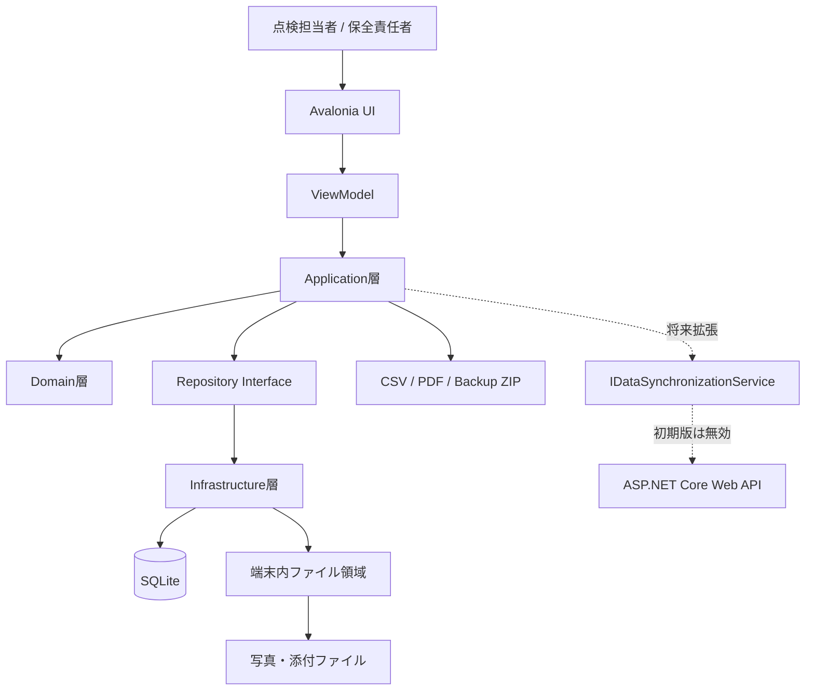
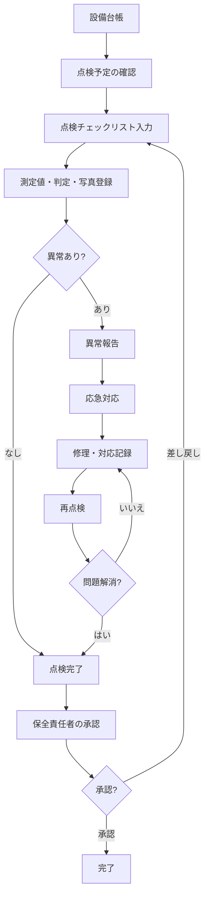
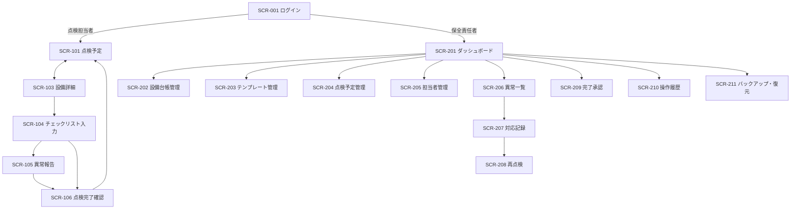
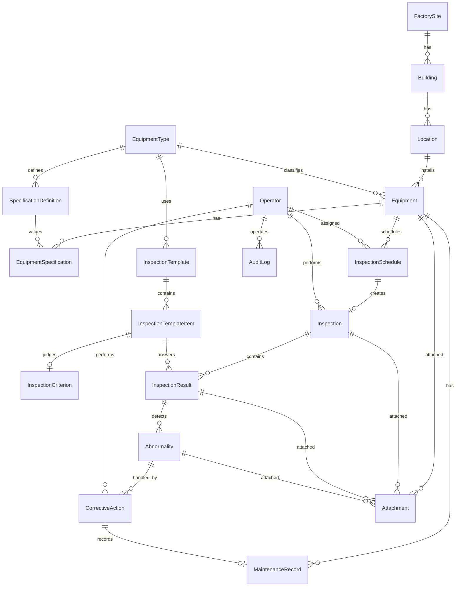
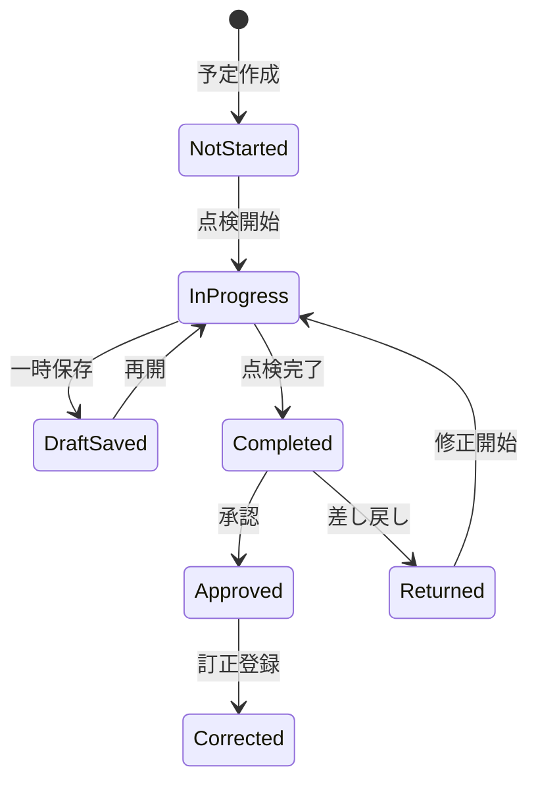
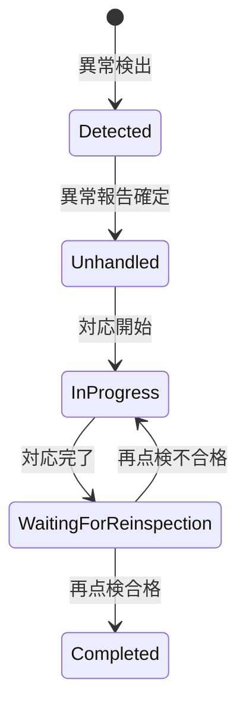

# 設備点検・保守記録アプリ 要素設計書（たたき台）

> 文書種別：要素設計書／今後の設計・実装プロンプト用ベース資料  
> 対象アプリ：中小製造工場のユーティリティ・付帯設備を対象とした日常点検・保守記録アプリ  
> 想定技術：Avalonia UI / C# / .NET / MVVM / EF Core / SQLite  
> 文書状態：ドラフト（未確定事項を含む）

---

## 0. この文書の使い方

本書は、設備点検アプリを今後詳細化するときの共通前提として使用する。

- 要件定義書・基本設計書・詳細設計書へ展開するためのたたき台
- ER図、画面設計、クラス設計、状態遷移図を作成する際の入力資料
- ChatGPT等へ実装や設計を依頼するときの前提プロンプト
- 未確定事項を明示し、会話の途中で前提が勝手に変わることを防ぐための資料

### 記号

| 記号 | 意味 |
|---|---|
| **確定** | 現時点の前提として扱う |
| **暫定** | たたき台として採用するが変更可能 |
| **要決定** | 実装前に決定が必要 |
| **将来拡張** | 初期版では実装しない |

---

## 1. 参照資料

- `構想.xlsx`
  - 対象者・運用前提
  - エンティティ候補
  - 業務フロー
  - 想定設備・点検項目・仕様項目
  - 画面遷移構想
- `設備点検アプリ設計.pdf`
  - 完全オフライン型の位置付け
  - Avalonia + SQLite構成
  - 状態遷移・業務ルール
  - 工場ユーティリティ設備を対象とするドメイン定義

---

## 2. システム概要

### 2.1 目的

通信環境が不安定な中小製造工場において、工場のユーティリティ・付帯設備に対する次の業務を、端末内で完結できるようにする。

- 設備台帳の管理
- 点検予定の確認・作成
- 点検チェックリストの入力
- 測定値・判定・写真の登録
- 異常報告
- 応急対応・修理・保守履歴の登録
- 再点検
- 完了承認・差し戻し
- 点検履歴・異常履歴の検索
- CSV・PDF帳票出力
- バックアップ・復元
- 操作・訂正履歴の保存

### 2.2 システムの位置付け

本アプリは、生産設備を直接制御するアプリではない。

対象は、工場全体または複数設備を支える次のような設備である。

- 圧縮空気設備
- 給排水・冷却水設備
- 空調・換気設備
- 集塵・排気設備

PLC通信、リアルタイム制御、センサー監視、製造装置制御は初期版の対象外とする。

### 2.3 ポートフォリオ上の説明文

> 通信環境が不安定な中小製造工場を想定し、サーバーに依存せず、設備台帳、日常点検、異常報告、保守履歴、再点検、帳票出力を端末内で完結できるAvalonia + SQLite製のオフライン業務アプリ。

---

## 3. 利用組織・利用規模

| 項目 | 内容 | 状態 |
|---|---|---|
| 会社 | 中小製造業 | 確定 |
| 拠点 | 1工場 | 確定 |
| 建物 | 第1工場・第2工場 | 確定 |
| 設備数 | 約30台 | 暫定 |
| 点検担当者 | 3～5人 | 暫定 |
| 保全責任者 | 1人 | 暫定 |
| 対応端末 | Androidタブレット / Windows PC | 確定 |
| 通信環境 | 工場内の一部で不安定 | 確定 |
| データ保存 | 各端末内SQLite | 確定 |
| サーバー | 初期版では使用しない | 確定 |
| 複数端末共同利用 | 初期版の対象外 | 確定 |

### 3.1 運用上の重要な制約

- Windows版とAndroid版の両方に対応する。
- 同時に複数端末で同じSQLiteデータベースを共同利用する運用は行わない。
- 端末ごとに独立したSQLiteデータを保持する。
- 初期版では中央サーバーとの同期を行わない。
- データセンター送信機能は将来拡張用の要素のみ用意し、通常画面には表示しない。
- 点検結果の保存時にオンラインAPIを呼び出さない。

---

## 4. 対象範囲

### 4.1 初期版の対象

1. ローカルログイン
2. 工場・建物・設置場所の管理
3. 設備種別・設備台帳の管理
4. 設備仕様の管理
5. 点検票テンプレートの管理
6. 点検予定の作成・確認
7. 点検実施・一時保存・完了
8. 写真添付
9. 異常報告
10. 応急対応・修理・対応記録
11. 再点検
12. 完了承認・差し戻し
13. 点検・異常・保守履歴検索
14. CSV出力
15. PDF点検報告書出力
16. バックアップ・復元
17. 操作・訂正履歴

### 4.2 初期版の対象外

- クラウド管理画面
- ASP.NET Core Web API
- 複数拠点間のリアルタイム共有
- 複数端末による同時編集
- 自動同期・差分同期
- 同期競合解決
- プッシュ通知
- PLC・センサーとの接続
- 法定点検専用の帳票・法令判定
- 医療機器・自動車・建設機械向けの専門保守

### 4.3 将来拡張

- ASP.NET Core Web APIとの同期
- 未送信データ一覧
- 手動送信・自動再送
- 同期エラー表示
- 二重登録防止
- 更新競合検出
- サーバー側での集計・承認

---

## 5. 利用者・権限

### 5.1 利用者区分

| ロール | 主な業務 |
|---|---|
| 点検担当者 | 点検予定確認、設備選択、点検入力、写真登録、異常報告、点検完了 |
| 保全責任者 | ダッシュボード確認、設備台帳管理、テンプレート管理、予定管理、異常対応、再点検確認、承認・差し戻し、履歴確認、バックアップ |

### 5.2 権限マトリクス（暫定）

| 機能 | 点検担当者 | 保全責任者 |
|---|:---:|:---:|
| ログイン | ○ | ○ |
| 本日の点検予定確認 | ○ | ○ |
| 点検入力・一時保存 | ○ | ○ |
| 点検完了 | ○ | ○ |
| 異常報告 | ○ | ○ |
| 応急対応登録 | ○ | ○ |
| 修理・対応記録 | △ | ○ |
| 完了承認・差し戻し | × | ○ |
| 設備台帳管理 | 参照 | ○ |
| 点検票テンプレート管理 | × | ○ |
| 点検予定管理 | 参照 | ○ |
| 担当者管理 | × | ○ |
| 操作履歴 | × | ○ |
| バックアップ・復元 | × | ○ |
| データセンター送信 | × | 非表示 |

---

## 6. システム構成



### 6.1 レイヤー構成

| レイヤー | 主な責務 |
|---|---|
| Presentation | Avalonia View、画面遷移、入力制御、表示状態 |
| ViewModel | 画面状態、Command、入力検証、Application層呼び出し |
| Application | ユースケース、トランザクション境界、権限確認、DTO変換 |
| Domain | エンティティ、値オブジェクト、状態遷移、業務ルール |
| Infrastructure | EF Core、SQLite、ファイル保存、帳票、バックアップ、ログ |

### 6.2 プロジェクト構成案

```text
FactoryMaintenance.slnx
├─ src/
│  ├─ FactoryMaintenance.App
│  │  ├─ Views/
│  │  ├─ ViewModels/
│  │  ├─ Navigation/
│  │  └─ Platform/
│  ├─ FactoryMaintenance.Application
│  │  ├─ Auth/
│  │  ├─ Equipments/
│  │  ├─ Inspections/
│  │  ├─ Abnormalities/
│  │  ├─ Maintenance/
│  │  ├─ Reports/
│  │  └─ Backups/
│  ├─ FactoryMaintenance.Domain
│  │  ├─ Sites/
│  │  ├─ Equipments/
│  │  ├─ Inspections/
│  │  ├─ Abnormalities/
│  │  └─ Common/
│  └─ FactoryMaintenance.Infrastructure
│     ├─ Persistence/
│     ├─ Files/
│     ├─ Reports/
│     ├─ Backups/
│     └─ Synchronization/
└─ tests/
   ├─ FactoryMaintenance.Domain.Tests
   ├─ FactoryMaintenance.Application.Tests
   └─ FactoryMaintenance.Infrastructure.Tests
```

---

## 7. 業務フロー



### 7.1 点検担当者の基本フロー

```text
ログイン
  ↓
本日の点検予定
  ↓
棟・場所選択
  ↓
点検対象設備一覧
  ↓
設備詳細
  ↓
チェックリスト入力
  ↓
測定値・写真登録
  ↓
異常報告（必要時）
  ↓
点検完了
```

### 7.2 保全責任者の基本フロー

```text
ログイン
  ↓
ダッシュボード
  ├─ 点検実施状況
  ├─ 異常一覧
  ├─ 対応中一覧
  ├─ 再点検待ち
  ├─ 完了承認
  └─ 差し戻し
```

---

## 8. 機能一覧

### 8.1 認証・利用者管理

| ID | 機能 | 概要 |
|---|---|---|
| AUT-001 | ローカルログイン | SQLiteに保存した利用者情報で認証する |
| AUT-002 | ログアウト | ローカルセッションを終了する |
| AUT-003 | 担当者管理 | 保全責任者が担当者を登録・無効化する |
| AUT-004 | 権限制御 | ロールに応じて表示・操作可能機能を切り替える |

### 8.2 設備台帳

| ID | 機能 | 概要 |
|---|---|---|
| EQP-001 | 設備一覧 | 工場、建物、場所、設備種別、状態で検索する |
| EQP-002 | 設備詳細 | 基本情報、仕様、写真、点検履歴を表示する |
| EQP-003 | 設備登録 | 設備情報と仕様値を登録する |
| EQP-004 | 設備編集 | 稼働中設備の台帳情報を更新する |
| EQP-005 | 設備無効化 | 廃止設備を論理削除または無効化する |
| EQP-006 | 設備写真 | 設備識別用の写真を保存する |

### 8.3 点検票テンプレート

| ID | 機能 | 概要 |
|---|---|---|
| TPL-001 | テンプレート一覧 | 設備種別別の点検票を表示する |
| TPL-002 | テンプレート登録 | 点検周期・点検項目を登録する |
| TPL-003 | 点検項目編集 | 入力形式、単位、必須、表示順を編集する |
| TPL-004 | 判定基準設定 | 数値の正常・要注意・異常範囲を設定する |
| TPL-005 | 版管理 | 使用中テンプレートを直接破壊せず、新版として更新する |

### 8.4 点検予定

| ID | 機能 | 概要 |
|---|---|---|
| SCH-001 | 点検予定一覧 | 日・週・月単位で予定を確認する |
| SCH-002 | 本日の予定 | 担当者別に本日の点検対象を表示する |
| SCH-003 | 予定作成 | 対象設備、点検票、予定日、担当者を設定する |
| SCH-004 | 予定変更 | 未実施の予定を変更する |
| SCH-005 | 期限超過表示 | 予定日を超過した未実施点検を警告する |

### 8.5 点検実施

| ID | 機能 | 概要 |
|---|---|---|
| INS-001 | 点検開始 | 点検予定から点検実績を生成する |
| INS-002 | チェックリスト入力 | 点検項目ごとに回答・測定値・判定を登録する |
| INS-003 | 自動判定 | 基準値により正常・要注意・異常を自動判定する |
| INS-004 | 写真登録 | 設備・点検項目・異常に写真を添付する |
| INS-005 | 一時保存 | 未完了の点検内容をSQLiteへ保存する |
| INS-006 | 点検再開 | 一時保存した点検を再開する |
| INS-007 | 点検完了 | 入力検証後に完了状態へ遷移する |
| INS-008 | 訂正 | 完了後の修正を訂正記録として保存する |

### 8.6 異常・保守対応

| ID | 機能 | 概要 |
|---|---|---|
| ABN-001 | 異常報告 | 異常内容、重要度、写真、コメントを登録する |
| ABN-002 | 応急対応 | 現場で実施した一時対応を登録する |
| ABN-003 | 対応開始 | 保全責任者が担当者と対応予定を設定する |
| ABN-004 | 修理・対応記録 | 原因、実施内容、部品、作業時間を記録する |
| ABN-005 | 再点検依頼 | 対応後に再点検待ちへ遷移する |
| ABN-006 | 再点検 | 対象項目を再確認する |
| ABN-007 | 異常完了 | 再点検合格後に異常対応を完了する |

### 8.7 承認・履歴

| ID | 機能 | 概要 |
|---|---|---|
| APR-001 | 完了承認一覧 | 承認待ち点検を表示する |
| APR-002 | 承認 | 完了済み点検を確定する |
| APR-003 | 差し戻し | 理由を付けて点検担当者へ戻す |
| HIS-001 | 点検履歴検索 | 設備、期間、担当者、判定で検索する |
| HIS-002 | 異常履歴検索 | 状態、重要度、設備、期間で検索する |
| HIS-003 | 保守履歴検索 | 設備ごとの修理・交換履歴を表示する |
| HIS-004 | 操作履歴 | 重要操作と訂正内容を表示する |

### 8.8 帳票・バックアップ

| ID | 機能 | 概要 |
|---|---|---|
| RPT-001 | 点検結果CSV | 検索結果をCSV出力する |
| RPT-002 | 点検報告書PDF | 点検単位でPDFを生成する |
| RPT-003 | 異常一覧CSV | 異常一覧をCSV出力する |
| BAK-001 | バックアップ | DB・写真・マニフェストをZIP出力する |
| BAK-002 | 復元 | バックアップZIPからデータを復元する |
| BAK-003 | 復元前検証 | バックアップ形式・バージョン・破損を検査する |

### 8.9 将来同期

| ID | 機能 | 初期版 |
|---|---|---|
| SYN-001 | データセンター送信 | 非表示・未実装 |
| SYN-002 | 同期結果表示 | 未実装 |
| SYN-003 | 未送信件数 | 未実装 |

---

## 9. 画面一覧

### 9.1 共通・点検担当者画面

| 画面ID | 画面名 | 主な機能 | ViewModel案 |
|---|---|---|---|
| SCR-001 | ログイン | 利用者選択、パスワード認証 | `LoginViewModel` |
| SCR-101 | 点検予定カレンダー・工場選択 | 本日の予定、棟・場所選択 | `InspectionScheduleViewModel` |
| SCR-102 | 点検対象設備一覧 | 予定対象設備、進捗・期限表示 | `InspectionTargetListViewModel` |
| SCR-103 | 設備台帳・設備詳細 | 基本情報、仕様、設備写真、履歴 | `EquipmentDetailViewModel` |
| SCR-104 | チェックリスト入力 | 点検回答、測定値、判定、写真 | `InspectionEntryViewModel` |
| SCR-105 | 異常報告 | 異常内容、重要度、写真、コメント | `AbnormalityReportViewModel` |
| SCR-106 | 点検完了確認 | 未入力確認、総合判定、完了 | `InspectionCompletionViewModel` |

### 9.2 保全責任者画面

| 画面ID | 画面名 | 主な機能 | ViewModel案 |
|---|---|---|---|
| SCR-201 | ダッシュボード | 実施状況、異常、対応中、再点検、承認 | `DashboardViewModel` |
| SCR-202 | 設備台帳管理 | 設備登録・編集・無効化 | `EquipmentManagementViewModel` |
| SCR-203 | 点検票テンプレート管理 | テンプレート・項目・基準管理 | `InspectionTemplateViewModel` |
| SCR-204 | 点検予定管理 | 予定作成・担当割当・変更 | `ScheduleManagementViewModel` |
| SCR-205 | 担当者管理 | 利用者・ロール・有効状態管理 | `OperatorManagementViewModel` |
| SCR-206 | 異常一覧・詳細 | 対応状況確認、対応開始 | `AbnormalityManagementViewModel` |
| SCR-207 | 修理・対応記録 | 原因・対応・部品・作業記録 | `CorrectiveActionViewModel` |
| SCR-208 | 再点検 | 再点検項目・結果登録 | `ReinspectionViewModel` |
| SCR-209 | 完了承認 | 承認・差し戻し | `ApprovalViewModel` |
| SCR-210 | 操作履歴 | 操作・訂正履歴検索 | `AuditLogViewModel` |
| SCR-211 | バックアップ・復元 | ZIP出力、検証、復元 | `BackupRestoreViewModel` |
| SCR-212 | データセンター送信 | 将来拡張用・通常は非表示 | `SynchronizationViewModel` |

### 9.3 画面遷移



---

## 10. ドメインモデル

### 10.1 エンティティ一覧

| エンティティ | 概要 |
|---|---|
| `FactorySite` | 工場・拠点 |
| `Building` | 第1工場・第2工場等の建物 |
| `Location` | 階、部屋、コンプレッサー室等の設置場所 |
| `EquipmentType` | エアコンプレッサー、冷却水ポンプ等の設備種別 |
| `Equipment` | 設備台帳 |
| `SpecificationDefinition` | 設備種別ごとの仕様項目定義 |
| `EquipmentSpecification` | 設備ごとの仕様値 |
| `InspectionTemplate` | 点検票テンプレート |
| `InspectionTemplateItem` | テンプレート内の点検項目 |
| `InspectionCriterion` | 数値・選択値の判定基準 |
| `InspectionSchedule` | 点検予定 |
| `Inspection` | 1回の点検実績 |
| `InspectionResult` | 項目ごとの入力・判定結果 |
| `Abnormality` | 異常報告 |
| `CorrectiveAction` | 応急対応・修理・是正処置 |
| `MaintenanceRecord` | 設備の保守・交換履歴 |
| `Attachment` | 写真・添付ファイルのメタ情報 |
| `Operator` | 点検担当者・保全責任者 |
| `AuditLog` | 操作・訂正履歴 |

### 10.2 ER関係（論理案）



---

## 11. エンティティ要素設計

> 項目は論理項目案。型・桁数・NULL制約は物理設計で確定する。

### 11.1 FactorySite

| 項目 | 内容 |
|---|---|
| `Id` | 主キー |
| `Code` | 工場コード |
| `Name` | 工場名 |
| `Address` | 所在地（任意） |
| `IsActive` | 有効状態 |
| `CreatedAt` / `UpdatedAt` | 作成・更新日時 |

### 11.2 Building

| 項目 | 内容 |
|---|---|
| `Id` | 主キー |
| `FactorySiteId` | 工場ID |
| `Code` | 建物コード |
| `Name` | 第1工場、第2工場等 |
| `DisplayOrder` | 表示順 |
| `IsActive` | 有効状態 |

### 11.3 Location

| 項目 | 内容 |
|---|---|
| `Id` | 主キー |
| `BuildingId` | 建物ID |
| `Code` | 場所コード |
| `Name` | 1F、2F、コンプレッサー室等 |
| `Description` | 補足 |
| `DisplayOrder` | 表示順 |
| `IsActive` | 有効状態 |

### 11.4 EquipmentType

| 項目 | 内容 |
|---|---|
| `Id` | 主キー |
| `Code` | 設備種別コード |
| `Name` | 設備種別名 |
| `Description` | 種別説明 |
| `IsActive` | 有効状態 |

### 11.5 Equipment

| 項目 | 内容 |
|---|---|
| `Id` | 主キー |
| `EquipmentCode` | 設備管理番号 |
| `Name` | 設備名称 |
| `EquipmentTypeId` | 設備種別ID |
| `LocationId` | 設置場所ID |
| `Manufacturer` | メーカー |
| `ProductName` | 製品名 |
| `ModelNumber` | 型式 |
| `SerialNumber` | シリアル番号 |
| `InstalledOn` | 設置年月日 |
| `OperationalStatus` | 稼働中、停止中、廃止等 |
| `Notes` | 備考 |
| `Version` | 楽観的ロック・更新管理用（暫定） |
| `CreatedAt` / `UpdatedAt` | 作成・更新日時 |

### 11.6 SpecificationDefinition

| 項目 | 内容 |
|---|---|
| `Id` | 主キー |
| `EquipmentTypeId` | 設備種別ID |
| `Code` | 仕様項目コード |
| `Name` | 吐出圧力、定格風量等 |
| `ValueType` | 文字列、数値、日付、選択肢 |
| `Unit` | MPa、m3/min、kW、V等 |
| `IsRequired` | 必須 |
| `DisplayOrder` | 表示順 |

### 11.7 EquipmentSpecification

| 項目 | 内容 |
|---|---|
| `Id` | 主キー |
| `EquipmentId` | 設備ID |
| `SpecificationDefinitionId` | 仕様項目定義ID |
| `TextValue` | 文字列値 |
| `NumericValue` | 数値 |
| `DateValue` | 日付 |
| `UpdatedAt` | 更新日時 |

### 11.8 InspectionTemplate

| 項目 | 内容 |
|---|---|
| `Id` | 主キー |
| `EquipmentTypeId` | 対象設備種別 |
| `Name` | テンプレート名 |
| `InspectionType` | 日常、週次、月次等 |
| `VersionNumber` | 版番号 |
| `EffectiveFrom` | 適用開始日 |
| `IsPublished` | 使用可能状態 |
| `IsCurrent` | 現行版 |

### 11.9 InspectionTemplateItem

| 項目 | 内容 |
|---|---|
| `Id` | 主キー |
| `InspectionTemplateId` | テンプレートID |
| `ItemCode` | 点検項目コード |
| `ItemName` | 点検項目名 |
| `InputType` | 真偽、選択、数値、文字列、写真確認等 |
| `Unit` | 単位 |
| `IsRequired` | 必須 |
| `RequiresPhotoOnAbnormal` | 異常時写真必須 |
| `RequiresCommentOnAbnormal` | 異常時コメント必須 |
| `DisplayOrder` | 表示順 |

### 11.10 InspectionCriterion

| 項目 | 内容 |
|---|---|
| `Id` | 主キー |
| `InspectionTemplateItemId` | 点検項目ID |
| `CriterionType` | 範囲、上限、下限、選択値 |
| `NormalMin` / `NormalMax` | 正常範囲 |
| `CautionMin` / `CautionMax` | 要注意範囲 |
| `AbnormalCondition` | 異常条件 |
| `Description` | 判定基準説明 |

### 11.11 InspectionSchedule

| 項目 | 内容 |
|---|---|
| `Id` | 主キー |
| `EquipmentId` | 対象設備 |
| `InspectionTemplateId` | 使用テンプレート |
| `ScheduledDate` | 点検予定日 |
| `AssignedOperatorId` | 担当者 |
| `Status` | 未実施、実施中、完了、期限超過等 |
| `Notes` | 備考 |

### 11.12 Inspection

| 項目 | 内容 |
|---|---|
| `Id` | 主キー |
| `InspectionScheduleId` | 点検予定ID |
| `EquipmentId` | 対象設備 |
| `TemplateVersion` | 実施時点のテンプレート版 |
| `OperatorId` | 実施者 |
| `StartedAt` | 開始日時 |
| `CompletedAt` | 完了日時 |
| `Status` | 点検状態 |
| `OverallJudgment` | 総合判定 |
| `ApprovalStatus` | 承認状態 |
| `ApprovedBy` / `ApprovedAt` | 承認者・承認日時 |
| `RejectionReason` | 差し戻し理由 |
| `RevisionNumber` | 訂正版数 |

### 11.13 InspectionResult

| 項目 | 内容 |
|---|---|
| `Id` | 主キー |
| `InspectionId` | 点検ID |
| `InspectionTemplateItemId` | 点検項目ID |
| `BooleanValue` | 真偽値 |
| `TextValue` | 文字列 |
| `NumericValue` | 数値 |
| `SelectedValue` | 選択値 |
| `Judgment` | 正常・要注意・異常・判定不能 |
| `Comment` | コメント |
| `EnteredAt` | 入力日時 |
| `EnteredBy` | 入力者 |

### 11.14 Abnormality

| 項目 | 内容 |
|---|---|
| `Id` | 主キー |
| `InspectionId` | 点検ID |
| `InspectionResultId` | 発生元の点検結果 |
| `EquipmentId` | 対象設備 |
| `Severity` | 軽微、要対応、重大等（要決定） |
| `Description` | 異常内容 |
| `DetectedAt` | 検出日時 |
| `DetectedBy` | 検出者 |
| `Status` | 異常対応状態 |
| `TemporaryAction` | 応急対応内容 |
| `DueDate` | 対応期限 |

### 11.15 CorrectiveAction

| 項目 | 内容 |
|---|---|
| `Id` | 主キー |
| `AbnormalityId` | 異常ID |
| `ActionType` | 応急、修理、交換、調整等 |
| `Cause` | 原因 |
| `ActionDescription` | 対応内容 |
| `PartsUsed` | 使用部品 |
| `PerformedBy` | 対応者 |
| `StartedAt` / `CompletedAt` | 開始・完了日時 |
| `RequiresReinspection` | 再点検要否 |

### 11.16 MaintenanceRecord

| 項目 | 内容 |
|---|---|
| `Id` | 主キー |
| `EquipmentId` | 設備ID |
| `CorrectiveActionId` | 対応記録ID（任意） |
| `MaintenanceType` | 点検、修理、交換、清掃等 |
| `Description` | 作業内容 |
| `PerformedOn` | 実施日 |
| `PerformedBy` | 実施者 |
| `NextRecommendedDate` | 次回推奨日 |

### 11.17 Attachment

| 項目 | 内容 |
|---|---|
| `Id` | 主キー |
| `OwnerType` | Equipment、Inspection、InspectionResult、Abnormality等 |
| `OwnerId` | 所有元ID |
| `FileName` | 保存ファイル名 |
| `OriginalFileName` | 元ファイル名 |
| `RelativePath` | アプリデータフォルダーからの相対パス |
| `ContentType` | MIMEタイプ |
| `FileSize` | ファイルサイズ |
| `CapturedAt` | 撮影日時 |
| `Description` | 説明 |
| `RegisteredBy` | 登録者 |
| `CreatedAt` | 登録日時 |

### 11.18 Operator

| 項目 | 内容 |
|---|---|
| `Id` | 主キー |
| `OperatorCode` | 担当者コード |
| `DisplayName` | 表示名 |
| `PasswordHash` | パスワードハッシュ |
| `Role` | Inspector / MaintenanceManager |
| `IsActive` | 有効状態 |
| `LastLoginAt` | 最終ログイン日時 |

### 11.19 AuditLog

| 項目 | 内容 |
|---|---|
| `Id` | 主キー |
| `OccurredAt` | 発生日時 |
| `OperatorId` | 操作者 |
| `ActionType` | 登録、更新、完了、承認、差し戻し、復元等 |
| `EntityType` | 対象種別 |
| `EntityId` | 対象ID |
| `BeforeValue` | 変更前概要またはJSON |
| `AfterValue` | 変更後概要またはJSON |
| `Reason` | 訂正・差し戻し理由 |

---

## 12. 列挙値・状態

### 12.1 点検状態



| 値 | 日本語 | 説明 |
|---|---|---|
| `NotStarted` | 未実施 | 点検予定のみ存在 |
| `InProgress` | 実施中 | 入力中 |
| `DraftSaved` | 一時保存 | 端末内に途中保存 |
| `Completed` | 完了 | 点検担当者が完了 |
| `Returned` | 差し戻し | 保全責任者が修正依頼 |
| `Approved` | 承認済み | 保全責任者が確定 |
| `Corrected` | 訂正済み | 承認後に訂正履歴を残した状態 |

### 12.2 判定

| 値 | 日本語 |
|---|---|
| `Normal` | 正常 |
| `Caution` | 要注意 |
| `Abnormal` | 異常 |
| `UnableToJudge` | 判定不能 |

### 12.3 異常対応状態



| 値 | 日本語 |
|---|---|
| `Detected` | 異常検出 |
| `Unhandled` | 未対応 |
| `InProgress` | 対応中 |
| `WaitingForReinspection` | 再点検待ち |
| `Completed` | 完了 |

### 12.4 承認状態（暫定）

| 値 | 日本語 |
|---|---|
| `NotRequired` | 承認不要 |
| `Pending` | 承認待ち |
| `Approved` | 承認済み |
| `Returned` | 差し戻し |

---

## 13. 主要業務ルール

### 13.1 点検入力

1. 点検開始時点のテンプレート版を点検実績に固定する。
2. 必須項目が未入力の場合、点検完了できない。
3. 数値項目は判定基準に従い、自動で正常・要注意・異常を判定する。
4. 自動判定後も、判定不能の選択を許可する場合は理由を必須とする。
5. 一時保存は未入力項目があっても可能とする。
6. 完了済み点検は通常編集できない。
7. 完了後の変更は「訂正」として処理し、変更前後と理由をAuditLogへ保存する。

### 13.2 異常

1. 異常判定の場合、コメントを必須とする。
2. 異常判定の場合、写真を必須とする。
3. 要注意で写真を必須にするかはテンプレート項目ごとに設定可能とする。
4. 異常報告には設備、点検、点検項目を関連付ける。
5. 異常対応を完了するには、原則として再点検を必須とする。
6. 再点検不合格の場合は対応中へ戻す。
7. 異常状態を完了へ直接変更する操作は禁止する。

### 13.3 承認・差し戻し

1. 点検担当者の完了操作後、承認対象の場合は承認待ちとする。
2. 保全責任者のみ承認・差し戻しできる。
3. 差し戻し理由は必須とする。
4. 承認済み点検の削除は禁止する。
5. 承認済み点検を訂正する場合は訂正理由を必須とする。

### 13.4 設備台帳・テンプレート

1. 点検履歴が存在する設備は物理削除しない。
2. 使用済みテンプレートは物理削除しない。
3. テンプレート変更時は新しい版として保存し、過去点検の表示を維持する。
4. 廃止設備は点検予定の新規作成対象から除外する。
5. 設備管理番号は端末内で一意とする。

### 13.5 バックアップ・復元

1. バックアップ中は更新処理を抑止または整合性のあるスナップショットを作成する。
2. ZIPにはSQLite DB、写真ファイル、マニフェストを含める。
3. 復元前にアプリ版・DBスキーマ版・ファイル整合性を検証する。
4. 復元実行前に現在データの退避バックアップを作成する。
5. 復元操作をAuditLogへ記録する。

---

## 14. 点検入力形式

| 入力形式 | 用途 | 例 |
|---|---|---|
| 真偽 | 実施・有無の確認 | ドレン排出を実施したか |
| 状態選択 | 正常状態の選択 | 正常 / 要注意 / 異常 |
| 数値 | 測定値 | 吐出圧力、電流値 |
| 文字列 | 補足入力 | 異常音の内容 |
| 複数選択 | 状況分類 | 汚れ、破損、閉塞 |
| 写真 | 証跡 | 設備外観、異常箇所 |

### 14.1 数値判定の考え方

```text
測定値
  ↓
InspectionCriterionを取得
  ↓
正常範囲内       → 正常
正常外・警告範囲 → 要注意
異常条件に該当   → 異常
基準未設定等      → 判定不能
```

---

## 15. 対象設備と点検項目

### 15.1 エアコンプレッサー

#### 仕様項目

- 設備写真
- 製品名
- 型式
- シリアル番号
- 吐出圧力
- 吐出空気量
- タンク容量
- 設置年月日

#### 点検項目

| 点検項目 | 入力形式 | 単位・選択 | 判定方式 |
|---|---|---|---|
| 運転音に異常がないか | 状態選択 | 正常/要注意/異常 | 手動 |
| 異常振動がないか | 状態選択 | 正常/要注意/異常 | 手動 |
| 空気圧は基準範囲内か | 数値 | MPa | 自動 |
| 油量は基準範囲内か | 状態選択または数値 | 要決定 | 手動/自動 |
| 漏れがないか | 真偽・状態選択 | なし/あり | 手動 |
| ドレン排出を実施したか | 真偽 | 実施/未実施 | 手動 |

### 15.2 冷却水ポンプ

#### 仕様項目

- 設備写真
- 製品名
- 型式
- シリアル番号
- 流量（吐出量）
- 全揚程
- 電源・出力（kW / V）
- 設置年月日

#### 点検項目

| 点検項目 | 入力形式 | 単位・選択 | 判定方式 |
|---|---|---|---|
| 異常音がないか | 状態選択 | 正常/要注意/異常 | 手動 |
| 異常振動がないか | 状態選択 | 正常/要注意/異常 | 手動 |
| 水漏れがないか | 真偽・状態選択 | なし/あり | 手動 |
| 吐出圧力 | 数値 | MPa等 | 自動 |
| 電流値 | 数値 | A | 自動 |
| 周辺に障害物がないか | 真偽 | なし/あり | 手動 |

### 15.3 換気設備

#### 仕様項目

- 設備写真
- 製品名
- 型式
- シリアル番号
- 定格風量
- 静圧
- モーター出力
- 電源電圧
- 回転数
- ダクト接続径
- フィルター形式
- 設置年月日

#### 点検項目

| 点検項目 | 入力形式 | 単位・選択 | 判定方式 |
|---|---|---|---|
| 運転状態 | 状態選択 | 運転/停止/異常 | 手動 |
| 異常音 | 状態選択 | 正常/要注意/異常 | 手動 |
| 異常振動 | 状態選択 | 正常/要注意/異常 | 手動 |
| フィルター汚れ | 状態選択 | 良好/要清掃/要交換 | 手動 |
| 吸排気口の閉塞 | 真偽・状態選択 | なし/あり | 手動 |
| 外観破損 | 真偽・状態選択 | なし/あり | 手動 |

---

## 16. 写真・ファイル管理

### 16.1 保存方針

写真のバイナリをSQLiteへ直接保存せず、アプリ専用フォルダーへファイルとして保存する。
SQLiteにはファイルの相対パス、撮影日時、説明、登録者等を保存する。

```text
AppData/
├─ database/
│  └─ factory-maintenance.db
├─ attachments/
│  ├─ equipments/
│  ├─ inspections/
│  └─ abnormalities/
├─ reports/
└─ backups/
```

### 16.2 ファイル登録処理

```text
写真選択・撮影
  ↓
ファイル形式・サイズ検証
  ↓
一時ファイルへ保存
  ↓
SQLiteトランザクション開始
  ↓
Attachmentメタ情報登録
  ↓
正式フォルダーへ移動
  ↓
コミット
```

### 16.3 要決定事項

- 対応形式：JPEG / PNG / WebP
- 1ファイルの上限サイズ
- 1点検項目あたりの最大枚数
- 画像圧縮・リサイズの有無
- Androidカメラ撮影時の権限処理
- Windowsでのファイル選択・カメラ対応範囲

---

## 17. SQLite・永続化設計

### 17.1 基本方針

- 端末内SQLiteを正本とする。
- すべての業務データをSQLiteへ保存する。
- 通信可否によって保存処理を分岐しない。
- データアクセスはRepository経由とする。
- 複数テーブルを更新する業務処理はトランザクションで実行する。
- 論理削除または有効状態を基本とする。

### 17.2 Repository例

```csharp
public interface IInspectionRepository
{
    Task<Inspection?> GetByIdAsync(
        Guid inspectionId,
        CancellationToken cancellationToken = default);

    Task AddAsync(
        Inspection inspection,
        CancellationToken cancellationToken = default);

    Task SaveChangesAsync(
        CancellationToken cancellationToken = default);
}
```

### 17.3 トランザクション境界例

- 点検開始
- 点検結果の一時保存
- 点検完了 + 異常報告作成
- 対応完了 + 再点検予定作成
- 承認・差し戻し
- 訂正 + AuditLog作成
- バックアップ前スナップショット
- 復元処理

---

## 18. 将来同期機能の設計境界

### 18.1 方針

初期版では同期処理を実装しない。ただし、Application層から同期方式を分離できるインターフェースを用意する。

```csharp
public interface IDataSynchronizationService
{
    Task<SynchronizationResult> SynchronizeAsync(
        CancellationToken cancellationToken = default);
}
```

### 18.2 初期版の実装案

```csharp
public sealed class OfflineDataSynchronizationService
    : IDataSynchronizationService
{
    public Task<SynchronizationResult> SynchronizeAsync(
        CancellationToken cancellationToken = default)
    {
        return Task.FromResult(
            SynchronizationResult.Disabled(
                "初期版はオフライン専用です。"));
    }
}
```

### 18.3 UI制御

- `SynchronizationEnabled = false` を初期値とする。
- データセンター送信ボタンは通常表示しない。
- デバッグまたは将来機能の確認時のみFeature Flagで表示可能とする。
- ボタンを誤って表示した場合も、未実装例外ではなく「無効」結果を返す。

---

## 19. Applicationサービス・ユースケース案

| サービス | 責務 |
|---|---|
| `AuthenticationService` | ローカル認証、ログアウト |
| `EquipmentService` | 設備台帳検索・登録・編集 |
| `InspectionTemplateService` | テンプレート・版・基準管理 |
| `InspectionScheduleService` | 点検予定作成・割当・期限判定 |
| `InspectionExecutionService` | 点検開始、一時保存、完了、自動判定 |
| `AbnormalityService` | 異常報告・状態遷移 |
| `CorrectiveActionService` | 応急対応・修理・再点検依頼 |
| `ApprovalService` | 承認・差し戻し・訂正 |
| `AttachmentService` | 写真保存・削除・整合性管理 |
| `ReportService` | CSV・PDF出力 |
| `BackupService` | バックアップ・検証・復元 |
| `AuditLogService` | 操作・訂正履歴保存 |
| `IDataSynchronizationService` | 将来同期の抽象化 |

---

## 20. ViewModel設計方針

### 20.1 共通方針

- ViewModelはDBへ直接アクセスしない。
- ViewModelからApplicationサービスを呼び出す。
- 画面入力モデルとDomain Entityを直接共有しない。
- 非同期処理は`AsyncCommand`等で実行する。
- 二重押下を防止する。
- 保存中・読込中・エラー状態を共通プロパティで扱う。

### 20.2 共通プロパティ案

```csharp
public abstract class ViewModelBase
{
    public bool IsBusy { get; protected set; }
    public string? ErrorMessage { get; protected set; }
    public string? SuccessMessage { get; protected set; }
}
```

### 20.3 InspectionEntryViewModelの要素案

```text
InspectionId
EquipmentSummary
InspectionItems
OverallJudgment
IsDraft
CanComplete
HasAbnormality
SaveDraftCommand
AddPhotoCommand
ReportAbnormalityCommand
CompleteInspectionCommand
CancelCommand
```

---

## 21. 入力検証・エラー処理

### 21.1 入力検証

- 必須入力
- 文字数上限
- 数値形式
- 数値範囲
- 日付整合性
- ファイル形式・サイズ
- 重複設備コード
- テンプレート項目の表示順重複
- 完了時の未入力項目
- 異常時の写真・コメント

### 21.2 エラー分類

| 分類 | 例 | UI対応 |
|---|---|---|
| 入力エラー | 必須項目不足 | 項目単位で表示 |
| 業務エラー | 完了済み点検を再編集 | ダイアログ・画面上部に表示 |
| DBエラー | SQLite書込失敗 | 再試行案内、ログ保存 |
| ファイルエラー | 写真保存失敗 | 対象ファイルを明示 |
| 復元エラー | ZIP破損・版不一致 | 復元を中止し現データを維持 |
| 予期しないエラー | 未捕捉例外 | 共通エラー画面・ログ保存 |

### 21.3 オフラインアプリで重視すること

- 保存失敗を「通信エラー」として扱わない。
- SQLiteと写真ファイルの不整合を残さない。
- アプリ強制終了後も一時保存データを再開できる。
- 完了処理は途中まで確定しない。

---

## 22. ログ設計

### 22.1 アプリケーションログ

- 起動・終了
- DBマイグレーション
- 画面遷移エラー
- SQLite例外
- ファイルI/O例外
- PDF・CSV生成失敗
- バックアップ・復元結果
- 未捕捉例外

### 22.2 業務監査ログ

- 設備登録・変更・無効化
- テンプレート公開・版更新
- 点検開始・一時保存・完了
- 異常報告
- 対応開始・完了
- 再点検結果
- 承認・差し戻し
- 訂正
- バックアップ・復元
- 担当者登録・無効化

---

## 23. 帳票設計（たたき台）

### 23.1 点検報告書PDF

1. 工場・建物・場所
2. 設備管理番号・設備名・型式
3. 点検日・担当者
4. 点検テンプレート名・版
5. 点検項目・入力値・判定・コメント
6. 総合判定
7. 異常内容・写真
8. 応急対応・修理記録
9. 再点検結果
10. 承認者・承認日時

### 23.2 CSV

- 設備台帳CSV
- 点検結果CSV
- 異常一覧CSV
- 保守履歴CSV

文字コード、区切り文字、日付形式は実装前に決定する。

---

## 24. バックアップ形式案

```text
factory-maintenance-backup_YYYYMMDD_HHMMSS.zip
├─ manifest.json
├─ database/
│  └─ factory-maintenance.db
└─ attachments/
   ├─ equipments/
   ├─ inspections/
   └─ abnormalities/
```

### 24.1 manifest.json案

```json
{
  "applicationVersion": "1.0.0",
  "schemaVersion": 1,
  "createdAt": "2026-08-01T06:00:00+09:00",
  "deviceId": "local-device-id",
  "databaseFile": "database/factory-maintenance.db",
  "attachmentCount": 0
}
```

> `deviceId`を使用するかは要決定。初期版で同期を行わなくても、バックアップ識別用として保持する案がある。

---

## 25. 非機能要件

### 25.1 可用性・信頼性

- 通信接続なしで主要業務を実行できる。
- 一時保存した点検をアプリ再起動後に再開できる。
- DB更新と関連ファイル操作の整合性を確保する。
- バックアップから復元できる。

### 25.2 性能目標（要決定）

| 項目 | 目標値 |
|---|---|
| アプリ起動 | `[要決定]` 秒以内 |
| 一覧初期表示 | `[要決定]` 秒以内 |
| 点検一時保存 | `[要決定]` 秒以内 |
| 約30設備・数年分履歴 | 実用上問題なく検索可能 |
| 写真表示 | サムネイルを利用し画面を停止させない |

### 25.3 セキュリティ

- パスワードは平文保存しない。
- ローカル認証情報はハッシュ化する。
- 権限に応じてメニュー・操作を制御する。
- バックアップファイルの暗号化は要決定。
- ログへパスワードや機微情報を出力しない。

### 25.4 保守性

- View、ViewModel、Application、Domain、Infrastructureを分離する。
- 設備種別・点検項目をコード固定せずマスタ化する。
- テンプレート版管理により過去データを維持する。
- Windows / Androidで業務ロジックを共通化する。

### 25.5 操作性

- 工場現場で手袋を使用する可能性を考慮し、主要ボタンを小さくしすぎない。
- 入力途中で画面遷移する場合は未保存警告を表示する。
- 正常・要注意・異常を文字とアイコンで識別する。
- 色だけに依存しない。
- Androidでは縦画面を基本とし、Windowsでは一覧性を重視する案とする。

---

## 26. テスト観点

### 26.1 Domain単体テスト

- 点検状態の正しい遷移
- 禁止された状態遷移
- 数値の自動判定
- 異常時の写真・コメント必須
- 点検完了条件
- 異常完了時の再点検必須
- 承認済み点検の直接編集禁止
- 訂正履歴生成
- テンプレート版管理

### 26.2 Application単体テスト

- 点検開始時の実績生成
- 一時保存
- 点検完了と異常作成のトランザクション
- 承認・差し戻し
- 対応完了と再点検予定作成
- バックアップ・復元前検証
- 権限チェック

### 26.3 Infrastructureテスト

- EF Coreマッピング
- SQLiteマイグレーション
- Repository CRUD
- トランザクションロールバック
- 写真保存・削除
- DBとファイルの不整合回復
- CSV・PDF生成
- バックアップZIP生成・復元

### 26.4 ViewModelテスト

- 初期表示
- Command活性・非活性
- 入力エラー表示
- 二重実行防止
- 一時保存後の状態
- 完了後の画面遷移
- 権限別メニュー表示

### 26.5 シナリオテスト

1. 正常点検を開始し、完了・承認する。
2. 点検を一時保存し、アプリ再起動後に再開する。
3. 数値が要注意範囲となり、自動判定される。
4. 異常判定で写真を付けずに完了しようとして拒否される。
5. 異常報告、応急対応、修理、再点検、完了まで実施する。
6. 点検を差し戻し、修正後に再提出する。
7. 承認済み点検を訂正し、履歴を確認する。
8. バックアップを作成し、別のローカル環境へ復元する。
9. 通信なしの状態で全ての主要業務を実施する。

---

## 27. 実装フェーズ案

### Phase 1：Windows版・基本基盤

- Avaloniaプロジェクト構成
- MVVM・DI・Navigation
- SQLite・EF Core・Migration
- ローカルログイン
- 工場・建物・場所・設備台帳
- 基本的な点検テンプレート

### Phase 2：点検業務

- 点検予定
- チェックリスト入力
- 自動判定
- 一時保存・再開
- 点検完了
- 異常報告

### Phase 3：保全責任者機能

- ダッシュボード
- 応急対応・修理記録
- 再点検
- 承認・差し戻し
- 履歴・監査ログ

### Phase 4：ファイル・帳票

- 写真管理
- CSV
- PDF
- バックアップ・復元

### Phase 5：Android調整

- Androidビルド
- 画面レイアウト最適化
- カメラ・ストレージ権限
- 実機またはエミュレーター確認

### Phase 6：将来拡張の境界

- `IDataSynchronizationService`
- Feature Flag
- 非表示の送信ボタン要素
- Offline実装

---

## 28. 未確定事項

| ID | 論点 | 現時点の案 |
|---|---|---|
| TODO-001 | 1端末運用か、担当者ごとに端末を持つか | 初期デモは1端末運用 |
| TODO-002 | ローカルログインのパスワード要件 | 要決定 |
| TODO-003 | 保全責任者の承認を全点検で必須にするか | 設定可能とする案 |
| TODO-004 | 点検周期 | 日次、週次、月次を初期対象とする案 |
| TODO-005 | 重要度区分 | 軽微、要対応、重大の3段階案 |
| TODO-006 | 要注意時の写真必須 | テンプレート設定式 |
| TODO-007 | PDFライブラリ | 実装段階で決定 |
| TODO-008 | 写真上限・圧縮 | Android実機確認後に決定 |
| TODO-009 | バックアップ暗号化 | ポートフォリオ初期版では任意 |
| TODO-010 | WindowsとAndroid間のデータ移行 | ZIPバックアップ・復元を使用する案 |
| TODO-011 | SQLite DBの暗号化 | 要否を検討 |
| TODO-012 | DeviceId保持 | 将来同期を考慮して保持する案 |
| TODO-013 | データセンター送信ボタン | Feature Flagで非表示 |
| TODO-014 | 点検項目の判定基準値 | デモ用の仮値を別途作成 |
| TODO-015 | 集塵設備を換気設備と同一種別にするか | 初期版は「換気・集塵設備」としてまとめる案 |

---

## 29. 今後のプロンプトで固定する前提

以下は、明示的な変更指示がない限り固定する。

1. アプリはAvalonia + C# + MVVM + EF Core + SQLiteで構築する。
2. WindowsとAndroidに対応する。
3. 初期版は完全オフライン型であり、サーバーを必要としない。
4. 端末ごとのSQLiteを使用し、複数端末での同時共同利用は対象外とする。
5. 対象は工場ユーティリティ・付帯設備であり、生産設備制御は対象外とする。
6. 対象設備は、エアコンプレッサー、冷却水ポンプ、換気・集塵設備を中心とする。
7. 点検、異常報告、対応、再点検、承認、帳票、バックアップを扱う。
8. 完了済みデータを直接書き換えず、訂正・監査履歴を残す。
9. 異常判定では写真とコメントを必須とする。
10. 将来同期用インターフェースは用意するが、初期版では非表示・無効とする。

---

## 30. 汎用プロンプトテンプレート

以下をコピーし、末尾に依頼内容を追加する。

```text
以下の要素設計書を前提に、設備点検・保守記録アプリの設計または実装を行ってください。

【固定前提】
- Avalonia UI / C# / .NET / MVVM / EF Core / SQLite
- Windows / Android対応
- 初期版は完全オフライン型
- 端末内SQLiteが正本
- 複数端末での同時共同利用は初期版の対象外
- 工場ユーティリティ・付帯設備の日常点検・保守記録が対象
- 対象設備はエアコンプレッサー、冷却水ポンプ、換気・集塵設備
- 点検予定、チェックリスト、測定値、自動判定、写真、異常報告、対応、再点検、承認、履歴、CSV/PDF、バックアップを扱う
- 異常判定時は写真とコメントを必須とする
- 完了済み点検の直接編集は禁止し、訂正履歴を残す
- 将来同期用IDataSynchronizationServiceは用意するが、初期版では機能を非表示・無効にする

【設計上のルール】
- ViewModelからDbContextを直接呼ばない
- Presentation / Application / Domain / Infrastructureを分離する
- 業務ルールはDomainまたはApplicationへ置く
- 使用済み点検テンプレートは版管理する
- SQLiteと写真ファイルの整合性を考慮する
- 未確定事項を勝手に確定せず、「暫定」「要決定」と明示する
- 既存の前提を変更する場合は、変更理由と影響範囲を示す

【今回の依頼】
ここに依頼内容を記載する。

【希望する出力】
- 前提
- 設計方針
- 対象ファイルまたはクラス一覧
- 実装例または図
- テスト観点
- 未確定事項
```

---

## 31. 用途別プロンプト例

### 31.1 ER図・DB設計

```text
本要素設計書を前提に、SQLite向けの物理DB設計を作成してください。
テーブル名、列名、SQLite型、NULL制約、主キー、外部キー、ユニーク制約、インデックス、論理削除方針をMarkdown表で示してください。
過去の点検テンプレート版と点検結果が壊れない設計にしてください。
最後にMermaid ER図を付けてください。
```

### 31.2 Domainモデル

```text
本要素設計書を前提に、Inspection、InspectionResult、Abnormality、CorrectiveActionを中心としたC# Domainモデルを設計してください。
状態遷移をEntityメソッドで制御し、public setterは使用しない方針にしてください。
正常系・異常系のxUnitテスト例も作成してください。
```

### 31.3 Avalonia画面

```text
本要素設計書を前提に、点検担当者向けのSCR-104 チェックリスト入力画面を設計してください。
WindowsとAndroidでViewModelを共通化し、Viewのレイアウト差分を最小限にしてください。
XAML構成、ViewModelのプロパティとCommand、入力検証、画面状態、ナビゲーションを示してください。
```

### 31.4 Applicationユースケース

```text
本要素設計書を前提に、点検完了ユースケースを設計してください。
必須項目確認、自動判定、異常時の写真・コメント確認、Inspection完了、Abnormality作成、AuditLog保存を1トランザクションとして扱ってください。
インターフェース、DTO、処理フロー、エラー種別、xUnitテスト観点を示してください。
```

### 31.5 バックアップ・復元

```text
本要素設計書を前提に、SQLite DBと写真フォルダーをZIP化するバックアップ・復元機能を設計してください。
整合性のあるDBスナップショット、manifest.json、復元前検証、失敗時のロールバック、AuditLogを含めてください。
```

---

## 32. レビュー時の確認チェックリスト

- [ ] 完全オフライン前提が崩れていないか
- [ ] 保存処理がAPI依存になっていないか
- [ ] 複数端末同時利用を暗黙に前提としていないか
- [ ] 点検テンプレートの版管理が考慮されているか
- [ ] 完了済み点検の直接編集を許していないか
- [ ] 異常時の写真・コメント必須が実装されているか
- [ ] 異常対応完了前に再点検を行っているか
- [ ] SQLiteと写真ファイルの整合性を保てるか
- [ ] 保全責任者と点検担当者の権限が分離されているか
- [ ] バックアップ・復元時にデータ破損を防げるか
- [ ] WindowsとAndroidで業務ロジックを共通化できているか
- [ ] 同期機能は初期版で非表示・無効になっているか
- [ ] 未確定事項を勝手に確定していないか

---

## 33. 文書更新履歴

| 版 | 日付 | 内容 |
|---|---|---|
| 0.1 | 2026-08-01 | 構想資料を基に要素設計書の初版を作成 |

